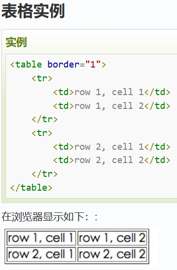
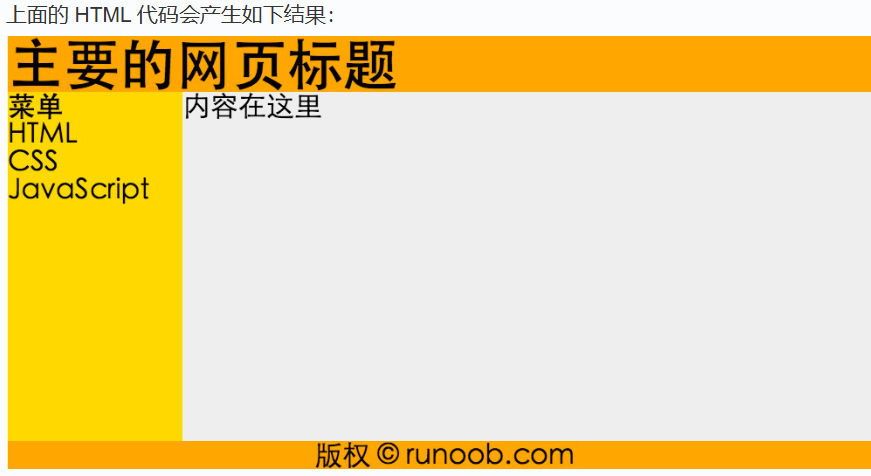
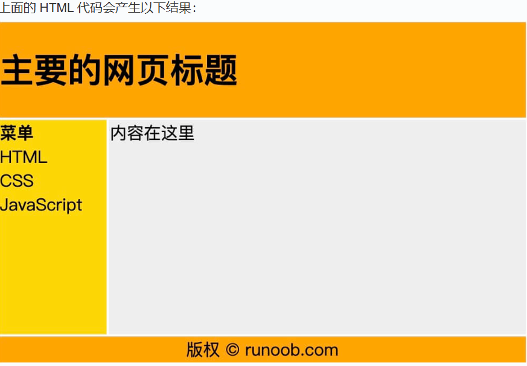
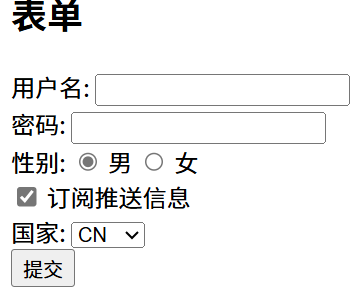

## HTML 表格

HTML 表格由 \<table\> 标签来定义。

HTML 表格是一种用于展示结构化数据的标记语言元素。

每个表格均有若干行（由 \<tr\> 标签定义），每行被分割为若干单元格（由 \<td\> 标签定义），表格可以包含标题行（\<th\>）用于定义列的标题。

- **tr**：tr 是 table row 的缩写，表示表格的一行。
- **td**：td 是 table data 的缩写，表示表格的数据单元格。
- **th**：th 是 table header的缩写，表示表格的表头单元格。

数据单元格可以包含文本、图片、列表、段落、表单、水平线、表格等等。

```html
<table>
  <thead>
    <tr>
      <th>列标题1</th>
      <th>列标题2</th>
      <th>列标题3</th>
    </tr>
  </thead>
  <tbody>
    <tr>
      <td>行1，列1</td>
      <td>行1，列2</td>
      <td>行1，列3</td>
    </tr>
    <tr>
      <td>行2，列1</td>
      <td>行2，列2</td>
      <td>行2，列3</td>
    </tr>
  </tbody>
</table>
```

以上的表格实例代码中，\<table\> 元素表示整个表格，它包含两个主要部分：\<thead\> 和 \<tbody\>。

-  **&lt;thead**  **&gt;**  **用于定义表格的标题部分:**  在 \<thead \> 中，使用 \<th \> 元素定义列的标题，以上实例中列标题分别为"列标题1"，"列标题2"和"列标题3"。
-  **&lt;tbody**  **&gt;**  **用于定义表格的主体部分:**  在 \<tbody \> 中，使用 \<tr \> 元素定义行，并在每行中使用 \<td \> 元素定义单元格数据，以上实例中有两行数据，每行包含三个单元格。





### HTML表格边框

就是调一下border的数量，我个人觉得调3比较好看


### HTML表格表头

表格的表头使用 \<th\> 标签进行定义。

大多数浏览器会把表头显示为粗体居中的文本


## HTML列表

### HTML无序列表

无序列表是一个项目的列表，此列项目使用粗体圆点（典型的小黑圆圈）进行标记。

无序列表使用 \<ul\> 标签

```html
<ul>
<li>Coffee</li>
<li>Milk</li>
</ul>
```

浏览器显示如下：

- Coffee
- Milk

### HTML 有序列表

同样，有序列表也是一列项目，列表项目使用数字进行标记。 有序列表始于 \<ol\> 标签。每个列表项始于 \<li\> 标签。

列表项使用数字来标记。

```html
<ol>
<li>Coffee</li>
<li>Milk</li>
</ol>
```


浏览器中显示如下：

1. Coffee
2. Milk

### HTML 自定义列表

自定义列表不仅仅是一列项目，而是项目及其注释的组合。

自定义列表以 \<dl\> 标签开始。每个自定义列表项以 \<dt\> 开始。每个自定义列表项的定义以 \<dd\> 开始。

```html
<dl>
<dt>Coffee</dt>
<dd>- black hot drink</dd>
<dt>Milk</dt>
<dd>- white cold drink</dd>
</dl>
```


浏览器显示如下：

Coffee

- black hot drink

Milk

- white cold drink


## HTML \<div\> 和\<span\>

HTML 可以通过 \<div\> 和 \<span\>将元素组合起来。

### HTML 区块元素

大多数 HTML 元素被定义为**块级元素**或**内联元素**。

块级元素在浏览器显示时，通常会以新行来开始（和结束）。

实例: \<h1\>, \<p\>, \<ul\>, \<table\>

### HTML 内联元素

内联元素在显示时通常不会以新行开始。

实例: \<b\>, \<td\>, \<a\>, \


### HTML \<div\> 元素

HTML \<div\> 元素是块级元素，它可用于组合其他 HTML 元素的容器。

\<div\> 元素没有特定的含义。除此之外，由于它属于块级元素，浏览器会在其前后显示折行。

如果与 CSS 一同使用，\<div\> 元素可用于对大的内容块设置样式属性。

\<div\> 元素的另一个常见的用途是文档布局。它取代了使用表格定义布局的老式方法。使用 \<table\> 元素进行文档布局不是表格的正确用法。\<table\> 元素的作用是显示表格化的数据。

### HTML \<span\> 元素

HTML \<span\> 元素是内联元素，可用作文本的容器

\<span\> 元素也没有特定的含义。

当与 CSS 一同使用时，\<span\> 元素可用于为部分文本设置样式属性。


## HTML布局

大多数网站可以使用 <div> 或者 <table> 元素来创建多列。CSS 用于对元素进行定位，或者为页面创建背景以及色彩丰富的外观。

**虽然我们可以使用HTML table标签来设计出漂亮的布局，但是table标签是不建议作为布局工具使用的 - 表格不是布局工具。**

### \<div\> 元素

div 元素是用于分组 HTML 元素的块级元素。

下面的例子使用五个 div 元素来创建多列布局

```html
<!DOCTYPE html>
<html>
<head> 
<meta charset="utf-8"> 
<title>菜鸟教程(runoob.com)</title> 
</head>
<body>
 
<div id="container" style="width:500px">
 
<div id="header" style="background-color:#FFA500;">
<h1 style="margin-bottom:0;">主要的网页标题</h1></div>
 
<div id="menu" style="background-color:#FFD700;height:200px;width:100px;float:left;">
<b>菜单</b><br>
HTML<br>
CSS<br>
JavaScript</div>
 
<div id="content" style="background-color:#EEEEEE;height:200px;width:400px;float:left;">
内容在这里</div>
 
<div id="footer" style="background-color:#FFA500;clear:both;text-align:center;">
版权 © runoob.com</div>
 
</div>
 
</body>
</html>
```



### \<table\>元素

使用 HTML \<table\> 标签是创建布局的一种简单的方式。

下面的例子使用三行两列的表格 - 第一和最后一行使用 colspan 属性来横跨两列

```html
<!DOCTYPE html>
<html>
<head> 
<meta charset="utf-8"> 
<title>菜鸟教程(runoob.com)</title> 
</head>
<body>
 
<table width="500" border="0">
<tr>
<td colspan="2" style="background-color:#FFA500;">
<h1>主要的网页标题</h1>
</td>
</tr>
 
<tr>
<td style="background-color:#FFD700;width:100px;">
<b>菜单</b><br>
HTML<br>
CSS<br>
JavaScript
</td>
<td style="background-color:#eeeeee;height:200px;width:400px;">
内容在这里</td>
</tr>
 
<tr>
<td colspan="2" style="background-color:#FFA500;text-align:center;">
版权 © runoob.com</td>
</tr>
</table>
 
</body>
</html>
```



### 一些提示

使用 CSS 最大的好处是，如果把 CSS 代码存放到外部样式表中，那么站点会更易于维护。通过编辑单一的文件，就可以改变所有页面的布局。

由于创建高级的布局非常耗时，使用模板是一个快速的选项。通过搜索引擎可以找到很多免费的网站模板（您可以使用这些预先构建好的网站布局，并优化它们）。


## HTML 表单和输入

HTML 表单用于收集用户的输入信息。

HTML 表单表示文档中的一个区域，此区域包含交互控件，将用户收集到的信息发送到 Web 服务器。

HTML 表单通常包含各种输入字段、复选框、单选按钮、下拉列表等元素。

以下是一个简单的HTML表单的例子：

```html
<form action="/" method="post">
    <!-- 文本输入框 -->
    <label for="name">用户名:</label>
    <input type="text" id="name" name="name" required>

    <br>

    <!-- 密码输入框 -->
    <label for="password">密码:</label>
    <input type="password" id="password" name="password" required>

    <br>

    <!-- 单选按钮 -->
    <label>性别:</label>
    <input type="radio" id="male" name="gender" value="male" checked>
    <label for="male">男</label>
    <input type="radio" id="female" name="gender" value="female">
    <label for="female">女</label>

    <br>

    <!-- 复选框 -->
    <input type="checkbox" id="subscribe" name="subscribe" checked>
    <label for="subscribe">订阅推送信息</label>

    <br>

    <!-- 下拉列表 -->
    <label for="country">国家:</label>
    <select id="country" name="country">
        <option value="cn">CN</option>
        <option value="usa">USA</option>
        <option value="uk">UK</option>
    </select>

    <br>

    <!-- 提交按钮 -->
    <input type="submit" value="提交">
</form>
```

实现效果如图：



其中：

- `<form>` 元素用于创建表单，`action` 属性定义了表单数据提交的目标 URL，`method` 属性定义了提交数据的 HTTP 方法（这里使用的是 "post"）。
- `<label>` 元素用于为表单元素添加标签，提高可访问性。
- `<input>` 元素是最常用的表单元素之一，它可以创建文本输入框、密码框、单选按钮、复选框等。`type` 属性定义了输入框的类型，`id` 属性用于关联 `<label>` 元素，`name` 属性用于标识表单字段。
- `<select>` 元素用于创建下拉列表，而 `<option>` 元素用于定义下拉列表中的选项。


### HTML 表单

表单是一个包含表单元素的区域。

表单元素是允许用户在表单中输入内容，比如：文本域（textarea）、下拉列表（select）、单选框（radio-buttons）、复选框（checkbox） 等等。

我们可以使用 \<form\> 标签来创建表单:

```html
<form>
.
input 元素
.
</form>
```


多数情况下被用到的表单标签是输入标签 \<input\>。

输入类型是由 type 属性定义。

下面介绍几种常用的输入类型。

#### 文本域（Text Fields）

文本域通过 <input type="text"> 标签来设定，当用户要在表单中键入字母、数字等内容时，就会用到文本域

```html
<form>
First name: <input type="text" name="firstname"><br>
Last name: <input type="text" name="lastname">
</form>
```

浏览器显示如下：


**注意:** 表单本身并不可见。同时，在大多数浏览器中，文本域的默认宽度是 20 个字符

#### 单选按钮（Radio Buttons）

\<input type\="radio"\> 标签定义了表单的单选框选项

```html
<form action="">
<input type="radio" name="sex" value="male">男<br>
<input type="radio" name="sex" value="female">女
</form>
```

浏览器显示效果如下:


#### 复选框（Checkboxes）

\<input type\="checkbox"\> 定义了复选框。

复选框可以选取一个或多个选项：

```html
<form>
<input type="checkbox" name="vehicle[]" value="Bike">我喜欢自行车<br>
<input type="checkbox" name="vehicle[]" value="Car">我喜欢小汽车
</form>
```

浏览器显示效果如下:


#### 提交按钮(Submit)

\<input type\="submit"\> 定义了提交按钮。

当用户单击确认按钮时，表单的内容会被传送到服务器。表单的动作属性 action 定义了服务端的文件名。

action 属性会对接收到的用户输入数据进行相关的处理:

```html
<form name="input" action="html_form_action.php" method="get">
Username: <input type="text" name="user">
<input type="submit" value="Submit">
</form>
```

浏览器显示效果如下:


假如您在上面的文本框内键入几个字母，然后点击确认按钮，那么输入数据会传送到 **html_form_action.php** 文件，该页面将显示出输入的结果。

以上实例中有一个 method 属性，它用于定义表单数据的提交方式，可以是以下值：

- `post`：指的是 HTTP POST 方法，表单数据会包含在表单体内然后发送给服务器，用于提交敏感数据，如用户名与密码等。
- `get`：默认值，指的是 HTTP GET 方法，表单数据会附加在 `action `属性的 URL 中，并以 `?`作为分隔符，一般用于不敏感信息，如分页等。例如：https://www.runoob.com/?page\=1，这里的 page\=1 就是 get 方法提交的数据。

## HTML 框架

通过使用框架，你可以在同一个浏览器窗口中显示不止一个页面。


### iframe - 设置高度与宽度

height 和 width 属性用来定义iframe标签的高度与宽度。

属性默认以像素为单位, 但是你可以指定其按比例显示 (如："80%")。

```html
<iframe src="demo_iframe.htm" width="200" height="200"></iframe>
```

### iframe - 移除边框

frameborder 属性用于定义iframe表示是否显示边框。

设置属性值为 "0" 移除iframe的边框：

```html
<iframe src="demo_iframe.htm" frameborder="0"></iframe>
```


### 使用 iframe 来显示目标链接页面

iframe 可以显示一个目标链接的页面

目标链接的属性必须使用 iframe 的属性，如下实例:

```html
‍<iframe src="demo_iframe.htm" name="iframe_a"></iframe>
<p><a href="https://www.runoob.com" target="iframe_a" rel="noopener">RUNOOB.COM</a></p>
```


## HTML 颜色

## HTML 脚本

JavaScript 使 HTML 页面具有更强的动态和交互性。

### HTML \<script\> 标签

\<script\> 标签用于定义客户端脚本，比如 JavaScript。

\<script\> 元素既可包含脚本语句，也可通过 src 属性指向外部脚本文件。

JavaScript 最常用于图片操作、表单验证以及内容动态更新。

下面的脚本会向浏览器输出"Hello World!"：

```html
<script>
document.write("Hello World!");
</script>
```

### HTML\<noscript\> 标签

\<noscript\> 标签提供无法使用脚本时的替代内容，比方在浏览器禁用脚本时，或浏览器不支持客户端脚本时。

\<noscript\>元素可包含普通 HTML 页面的 body 元素中能够找到的所有元素。

只有在浏览器不支持脚本或者禁用脚本时，才会显示 \<noscript\> 元素中的内容：

```html
<script>
document.write("Hello World!")
</script>
<noscript>抱歉，你的浏览器不支持 JavaScript!</noscript>
```

## HTML 字符实体

HTML 中的预留字符必须被替换为字符实体。

一些在键盘上找不到的字符也可以使用字符实体来替换。

### HTML 实体

在 HTML 中，某些字符是预留的。

在 HTML 中不能使用小于号（\<）和大于号（\>），这是因为浏览器会误认为它们是标签。

如果希望正确地显示预留字符，我们必须在 HTML 源代码中使用字符实体（character entities）。 字符实体类似这样：

`&entity_name`  或 `&#entity_number`

如需显示小于号，我们必须这样写：`&lt；` 或  `&#60；` 或 `&#060；`

**提示：**  使用实体名而不是数字的好处是，名称易于记忆。不过坏处是，浏览器也许并不支持所有实体名称（对实体数字的支持却很好）。

### 不间断空格(Non-breaking Space)

HTML 中的常用字符实体是不间断空格( )。

浏览器总是会截短 HTML 页面中的空格。如果您在文本中写 10 个空格，在显示该页面之前，浏览器会删除它们中的 9 个。如需在页面中增加空格的数量，您需要使用   字符实体。

### 结合音标符

发音符号是加到字母上的一个"glyph(字形)"。

一些变音符号, 如 尖音符 (  ̀) 和 抑音符 (  ́) 。

变音符号可以出现字母的上面和下面，或者字母里面，或者两个字母间。

变音符号可以与字母、数字字符的组合来使用。

音标符的实例和字符实体的实例都直接到[HTML 字符实体 | 菜鸟教程](https://www.runoob.com/html/html-entities.html)上找吧

## HTML 统一资源定位器(Uniform Resource Locators)

URL 是一个网页地址。

URL可以由字母组成，如"runoob.com"，或互联网协议（IP）地址： 192.68.20.50。大多数人进入网站使用网站域名来访问，因为 名字比数字更容易记住。

### URL - 统一资源定位器

Web浏览器通过URL从Web服务器请求页面。

当您点击 HTML 页面中的某个链接时，对应的 \<a\> 标签指向万维网上的一个地址。

一个统一资源定位器(URL) 用于定位万维网上的文档。

`scheme://host.domain:port/path/filename`

说明:

- scheme - 定义因特网服务的类型。最常见的类型是 http
- host - 定义域主机（http 的默认主机是 www）
- domain - 定义因特网域名，比如 runoob.com
- :port - 定义主机上的端口号（http 的默认端口号是 80）
- path - 定义服务器上的路径（如果省略，则文档必须位于网站的根目录中）。
- filename - 定义文档/资源的名称

### 常见的 URL Scheme

以下是一些URL scheme：

| Scheme | 访问               | 用于...                             |
| -------- | -------------------- | ------------------------------------- |
| http   | 超文本传输协议     | 以 http:// 开头的普通网页。不加密。 |
| https  | 安全超文本传输协议 | 安全网页，加密所有信息交换。        |
| ftp    | 文件传输协议       | 用于将文件下载或上传至网站。        |
| file   |                    | 您计算机上的文件                    |

### URL 字符编码

URL 只能使用 [ASCII 字符集](https://www.runoob.com/tags/html-ascii.html).

来通过因特网进行发送。由于 URL 常常会包含 ASCII 集合之外的字符，URL 必须转换为有效的 ASCII 格式。

URL 编码使用 "%" 其后跟随两位的十六进制数来替换非 ASCII 字符。

URL 不能包含空格。URL 编码通常使用 + 来替换空格。

## HTML 速查列表

[HTML 速查列表 | 菜鸟教程](https://www.runoob.com/html/html-quicklist.html)

## HTML 标签简写及全称

[HTML 标签简写及全称 | 菜鸟教程](https://www.runoob.com/html/html-tag-name.html)