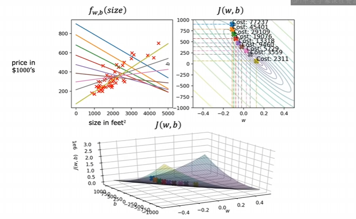
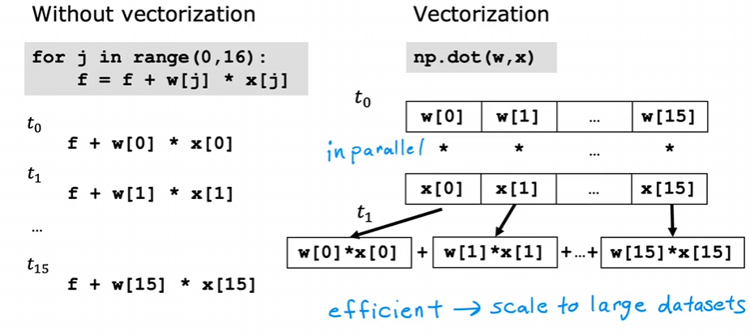
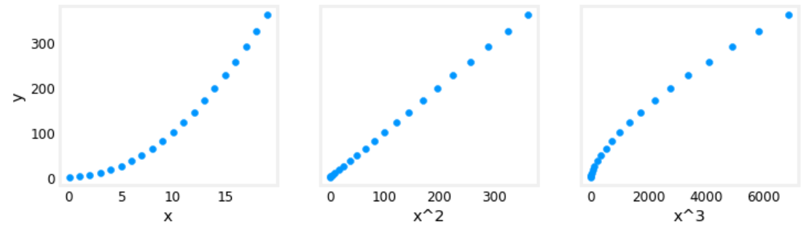
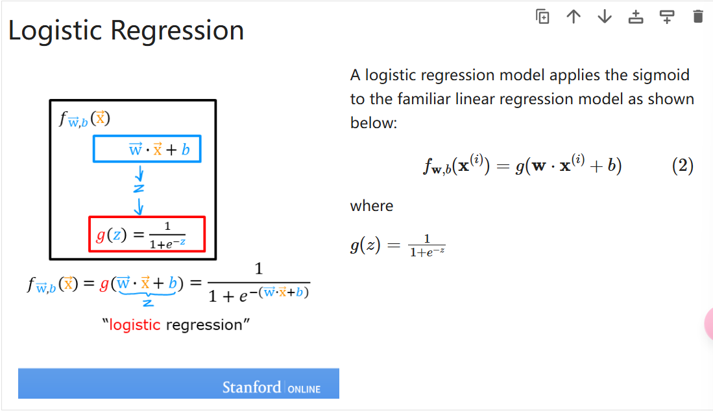
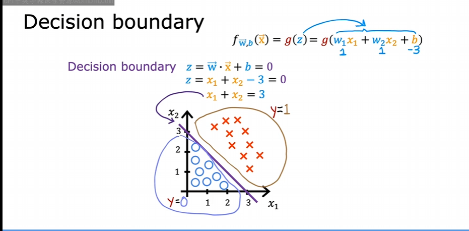

## 0什么是机器学习

亚瑟·塞缪尔：她将机器学习定义为使计算机能够在不经过明确编程的情况下进行学习的研究领域

目前最常用的学习算法类型是：

- 监督学习
- 无监督学习
- 推荐系统

### 0.1监督学习

- **定义**：学习x到y或输入到输出的算法，就是学一些正确的xy对应，然后机器可以对输入x判断出正确的输出y

#### 0.1.1回归

- 预测连续的数值，主要方法是建立映射来确定输入输出关系，将会预测符合关系的任何数字

#### 0.1.2**分类**

- 预测离散的类别标签，相当于是找到界限讲数据拟合边界线

### 0.2无监督学习

- 定义：从没有标签的数据中学习有用的模式、结构或信息，只有输入特征x，而没有正确的输出y，算法要自己去发现内在规律

#### 0.2.1聚类

- 将数据点分成若干个相似的组（簇），使得同一簇内的数据点相似度高，不同簇之间的数据点相似度低

## 1线性回归

它假设输入和输出有线性关系，先随机初始化一个线性关系，通过某种方式不断调整参数来最小化误差。

### 1.1成本函数

 用于衡量模型预测的好坏

$$
J(w, b) = \frac{1}{2m} \sum_{i=1}^{m} (f_{w, b}(x^{(i)}) - y^{(i)})^2
$$

### 1.2梯度下降

一个很适洽的比喻：在山上的最高一点，朝一个方向迈一小步，如何能尽快的下山？方式就是每一小步都是最陡的下降方向

$$
\begin{cases}
\text{tmp\_w} = w - \alpha \frac{\partial J(w, b)}{\partial w} \\
\text{tmp\_b} = b - \alpha \frac{\partial J(w, b)}{\partial b} \\
w = \text{tmp\_w} \\
b = \text{tmp\_b}
\end{cases}
$$


$$
w = w - \alpha \frac{\partial J(w, b)}{\partial w} 
b = b - \alpha \frac{\partial J(w, b)}{\partial b}
$$

				

求偏导后得到：

$$
\frac{\partial J(w, b)}{\partial w} = \frac{1}{m} \sum_{i=0}^{m-1} (f_{w, b}(x^{(i)}) - y^{(i)}) x^{(i)}
$$

$$
\frac{\partial J(w, b)}{\partial b} = \frac{1}{m} \sum_{i=0}^{m-1} (f_{w, b}(x^{(i)}) - y^{(i)})
$$

- 越接近 j(w,b) 的最小值，梯度下降越慢

#### 学习率 (learing rate)

- 如果 α 过小，所需的调整次数会增加
- 如果 α 过大，梯度下降可能无法收敛

#### 可能存在的问题

- 局部最小不是全局最小

#### 拟合过程



#### 梯度下降的代码实现

```python
import math, copy
import numpy as np
import matplotlib.pyplot as plt
plt.style.use('./deeplearning.mplstyle')
from lab_utils_uni import plt_house_x, plt_contour_wgrad, plt_divergence, plt_gradients

# Load our data set
x_train = np.array([1.0, 2.0])   # features
y_train = np.array([300.0, 500.0])   #target value

#Function to calculate the cost
def compute_cost(x, y, w, b):

    m = x.shape[0] 
    cost = 0

    for i in range(m):
        f_wb = w * x[i] + b
        cost = cost + (f_wb - y[i])**2
    total_cost = 1 / (2 * m) * cost

    return total_cost

def compute_gradient(x, y, w, b): 
    # Number of training examples
    m = x.shape[0]    
    dj_dw = 0
    dj_db = 0

    for i in range(m):  
        f_wb = w * x[i] + b 
        dj_dw_i = (f_wb - y[i]) * x[i] 
        dj_db_i = f_wb - y[i] 
        dj_db += dj_db_i
        dj_dw += dj_dw_i 
    dj_dw = dj_dw / m 
    dj_db = dj_db / m 

    return dj_dw, dj_db


def gradient_descent(x, y, w_in, b_in, alpha, num_iters, cost_function, gradient_function): 
    
    # An array to store cost J and w's at each iteration primarily for graphing later
    J_history = []
    p_history = []
    b = b_in
    w = w_in

    for i in range(num_iters):
        # Calculate the gradient and update the parameters using gradient_function
        dj_dw, dj_db = compute_gradient(x, y, w , b)     

        # Update Parameters using equation (3) above
        b = b - alpha * dj_db                            
        w = w - alpha * dj_dw                            

        # Save cost J at each iteration
        if i<100000:      # prevent resource exhaustion 
            J_history.append( compute_cost(x, y, w , b))
            p_history.append([w,b])
        # Print cost every at intervals 10 times or as many iterations if < 10
        if i% math.ceil(num_iters/10) == 0:
            print(f"Iteration {i:4}: Cost {J_history[-1]:0.2e} ",
                  f"dj_dw: {dj_dw: 0.3e}, dj_db: {dj_db: 0.3e}  ",
                  f"w: {w: 0.3e}, b:{b: 0.5e}")

    return w, b, J_history, p_history #return w and J,w history for graphing

# initialize parameters
w_init = 0
b_init = 0
# some gradient descent settings
iterations = 10000
tmp_alpha = 1.0e-2
# run gradient descent
w_final, b_final, J_hist, p_hist = gradient_descent(x_train ,y_train, w_init, b_init, tmp_alpha, 
                                                    iterations, compute_cost, compute_gradient)
```

## 2 多元线性回归

### 2.1 矢量化

- 原方法

$$
f_{\mathbf{w},\mathbf{b}}(\mathbf{x}) = \sum_{j=1}^{n} w_j x_j + b
$$

```python
f = 0
for j in range(n):
	f = f + w[j] * x[j]
f = f + b
```

- 矢量化：矢量化的代码可以在更短的时间内执行计算

$$
f_{w,b}(\mathbf{x}) = \vec{w} \cdot \vec{x} + b
$$

```python
f = np.dot(w,x) + b
```

- 原理



### 2.2 特征缩放 feature scaling

- **定义**：把不同量纲、取值范围的特征调整到相近的尺度，方便算法学习。

- 好处：一些算法对尺度敏感（如距离、梯度、正则化等），缩放后训练更稳定、收敛更快、模型表现更好。

#### **常见的缩放方法**

- 最小-最大缩放（Min-Max Scaling）：将特征x变换到 [0, 1] 或 [-1, 1]，公式常用 x’ = (x - min)/(max - min)。对异常值敏感。
- 标准化（Standardization，Z-score）：x’ = (x - mean)/std，（std是标准差）使特征具有均值0、方差1。对异常值比 Min-Max 稍鲁棒，但仍会受极端值影响。
- 鲁棒缩放（Robust Scaling）：x’ = (x - median)/IQR，（IQR是四分位距，是七十五分位数减二十五分位数）使用中位数和四分位距，适合有离群值的数据。
- 最大绝对值缩放（MaxAbs Scaling）：x’ = x / max(|x|)，保持稀疏性，常用于稀疏数据。
- 单位向量缩放（Unit Vector Scaling）：把每个样本向量缩放到单位范数，常用于文本分类等场景。

### 2.3特征工程

- **特征工程**:**从原始数据中提取、转换或创建更有意义的特征，以提高机器学习模型的表现**,**能够提高预测准确性**

  - 如发现 *wx+b* 拟合效果不好，创建一个特征 *x*<sup>*2*</sup> ,尝试用 *w*<sub>*0*</sub>*x*<sub>*0*</sub> *+w*<sub>*1*</sub>*x*<sub>*1*</sub><sup>*2*</sup>

- 没有进行梯度下降之前就可以使用替代视图进行拟合效果分析

```python
# create target data
x = np.arange(0, 20, 1)
y = x**2

# engineer features .
X = np.c_[x, x**2, x**3]   #<-- added engineered feature
X_features = ['x','x^2','x^3']

fig,ax=plt.subplots(1, 3, figsize=(12, 3), sharey=True)
for i in range(len(ax)):
    ax[i].scatter(X[:,i],y)
    ax[i].set_xlabel(X_features[i])
ax[0].set_ylabel("y")
plt.show()
```



- 一个问题是 x,x2,x3 的尺度可能会有较大差异，可以使用 z-score 归一化来解决

```python
x = np.arange(0,20,1)
y = x**2

X = np.c_[x, x**2, x**3]
X = zscore_normalize_features(X) 

model_w, model_b = run_gradient_descent_feng(X, y, iterations=100000, alpha=1e-1)
```

### 2.4多项式回归

- 定义：多项式回归是在自变量 x 和因变量 y 之间拟合一个多项式关系的回归方法。它是线性回归的一种扩展，因为对参数的估计仍是线性的（只是特征变成了 x 的多项式项）。
- 常见形式：给定度数 d，模型写成 y ≈ β<sub>0</sub> + β<sub>1</sub> x + β<sub>2</sub> x<sup>2</sup> + … + β<sub>d</sub> x<sup>d</sup>。通过最小二乘法估计系数 β。

## 3逻辑回归

- 一种用于**二分类**的算法
- 原先的线性方程不能很好地拟合二分类的图像
- 于是进行了巧妙的映射，如下



### 3.1 决策边界

是吧特征空间分成“属于哪一类”的界限

在逻辑回归中，我们使用 **Sigmoid 函数** 计算概率：
一般当 g(z) = 1 / (1 + e<sup>-z</sup>) >0.5 , g(z) > 0.5时，我们认为 y \= 1, 而这个点恰好对应 $ \vec{w} \cdot \vec{x} $ + b = 0



### 3.2 逻辑回归的成本函数

如果还是使用线性回归的成本函数，得到的曲线有多个局部最小值。所以需要另外定义一个成本函数。

- 逻辑回归的损失函数如下，只针对一个样本

$$
loss(f_{w,b}(x^{(i)}), y^{(i)}) = \begin{cases} -\log(f_{w,b}(x^{(i)})) & \text{if } y^{(i)} = 1 \\ -\log(1 - f_{w,b}(x^{(i)})) & \text{if } y^{(i)} = 0 \end{cases} 
$$

也可以简写为

$$
loss(f_{w,b}(x^{(i)}), y^{(i)}) = -y^{(i)}\log(f_{w,b}(x^{(i)})) - (1 - y^{(i)})\log(1 - f_{w,b}(x^{(i)}) 
$$ 

合理之处在于如果预测值接近正确类别损失较小，如果预测值接近错误类别损失较大，同时连续且可微，便于梯度下降优化

- 成本函数如下

$$
J(w,b) = \dfrac{1}{m} \sum_{i=0}^{m-1} \text{loss}\left( f_{w,b}(\mathbf{x}^{(i)}), y^{(i)} \right) 
$$

- 代码实现

```python
def compute_cost_logistic(X, y, w, b):
    m = X.shape[0]
    cost = 0.0
    for i in range(m):
        z_i = np.dot(X[i],w) + b
        f_wb_i = sigmoid(z_i)
        cost +=  -y[i]*np.log(f_wb_i) - (1-y[i])*np.log(1-f_wb_i)

    cost = cost / m
    return cost
```

### 3.3过拟合

- **定义**：对给出的样本拟合效果很好但是预测效果不佳

- 解决方案：

  - 更多的训练数据
  - 减少特征数量
  - 正则化

#### 正则化

- **定义**：通过**引入额外的信息或约束**来**防止过拟合**、**提高模型泛化能力**

- 对于高阶的特征项，我们通常希望它们的系数较小，以减少模型复杂度，防止过拟合