## git简介

### 是什么

- Git是⼀个免费、开源的分布式版本控制系统，旨在快速高效地处理从小到大的所有项目

### 基本操作

#### 1.创建本地仓库： `git init`

- 该命令会在当前目录下创建⼀个名为 `.git` 的隐藏子目录，这个目录包含了Git仓库的所有必要⽂件，例如对象数据库、索引文件、配置信息等。这个就是您的本地Git仓库。

#### 2.添加文件到暂存区： `git add`

- 在Git中，⽂件的修改需要经过两个阶段才能被提交到版本库：首先是添加到暂存区 （Staging Area），然后才是提交到版本库

- 暂存区是⼀个中间区域，用于存放您希望在下一次提交中包含的更改。 `git add`命令就是用来将工作目录中的文件添加到暂存区的

#### 3.提交文件到版本库： `git commit`

- 当您将所有希望提交的更改都添加到了暂存区后，就可以使⽤ `git commit` 命令将这些更改永久地保存到Git版本库中

- 每⼀次提交都会生成⼀个唯⼀的提交ID（commit ID），并包含提交者信息、提交时间以及提交信息（commit message）。提交信息是本次提交的简要说明，非常重要，它能帮助您和团队成员理解每次提交的目的和内容。

其中，**`git commit -m "xxx"`** 是我们常见的命令，`-m` 后面的指令就是此次提交的信息，如果没有 `-m` 选项，Git会打开您配置的默认编辑器，让你输入提交信息

提交成功后，您会看到类似以下输出： `[master (root-commit) 7c9a2b3] Initial commit: Add README and main.py 2 files changed, 0 insertions(+), 0 deletions(-) create mode 100644 README.md create mode 100644 main.py`其中 `7c9a2b3` 是本次提交的简短提交ID。

#### 4\.查看仓库状态： `git status`

`git status` 命令⽤于查看工作目录和暂存区的当前状态。它会告诉您哪些文件被修改了但尚未暂存，哪些文件已暂存但尚未提交，以及哪些⽂件是未被Git追踪的新⽂件。这是⼀个非常常用的命令，可以帮助您随时了解仓库的状况。

可能的状态输出：

- ⼲净的⼯作区：`On branch master nothing to commit, working tree clean`这表⽰您的工作目录和暂存区都没有未提交的更改。

- 有未追踪的⽂件：

```On branch master Untracked files: (use "git add ..." to include in what will be committed)

```bash
new_file.txt
```

nothing added to commit but untracked files present (use "git add" to track)  \```

这表示您创建了一个新文件`new_file.txt`，但尚未将其添加到Git的追踪范围。

- 有已修改但未暂存的⽂件：

 \`\`\` On branch master Changes not staged for commit: (use "git add ..." to update what will be committed) (use "git restore ..." to discard changes in working directory)

```bash
modified:    README.md
```

no changes added to commit (use "git add" and/or "git commit -a")

这表示`README.md`⽂件已被修改，但尚未添加到暂存区。

- 有已暂存但未提交的⽂件：

\`\`\` On branch master Changes to be committed: (use "git restore --staged ..." to unstage)

```bash
new file: another_file.txt
modified: main.py
```

\`\`

这表示`another\_file.txt` 是新文件且已暂存，`main.py`已被修改且已暂存，等待提交。

#### 5.查看提交历史： `git log`

- `git log` 命令⽤于查看项⽬的提交历史。它会按时间倒序显示所有的提交记录，包括提交 ID、作者、提交日期和提交信息。这是理解项目演变过程和查找特定更改的重要工具。

- `git log`：查看所有提交历史
- `git log --oneline`：查看简要的提交历史（一行显示）
- `git log --oneline --gragh --all`：查看图形化的提交历史

#### 6.比较文件差异： `git diff`

- `git diff` 命令⽤于⽐较不同版本之间或工作目录与暂存区之间的⽂件差异。这是在提交前 检查更改内容，或在事后理解特定提交所做更改的重要⼯具

操作示例：

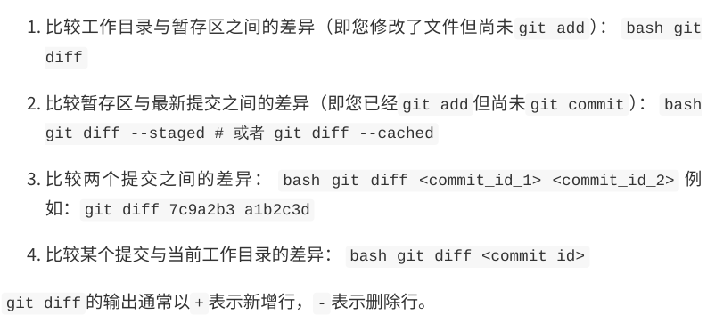

7.撤销修改：`git restore`/`git reset`

- 在Git中，撤销操作是⽇常开发中不可避免的⼀部分。Git提供了多种撤销命令，⽤于处理不同阶段的撤销需求

**`git restore`**  **：撤销工作目录或暂存区的修改**

- `git restore`  命令主要⽤于撤销⼯作⽬录中未暂存的修改，或者将暂存区中的⽂件恢复到 未暂存状态

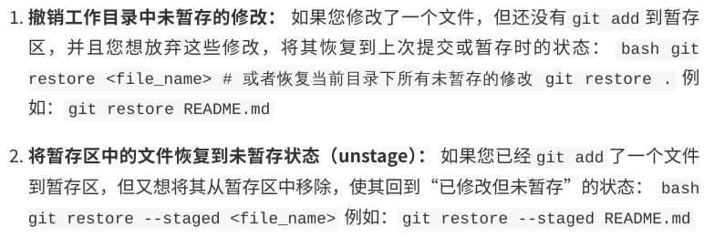

**`git reset`**  **：重置HEAD到指定状态**

- `git reset` 命令是⼀个更强⼤的撤销⼯具，它可以⽤来重置HEAD指针，从⽽改变分⽀的指向，并可以选择性地修改暂存区和⼯作⽬录

- `git reset` 有三种模式：`--soft` 、`-- mixed` （默认）和`--hard`

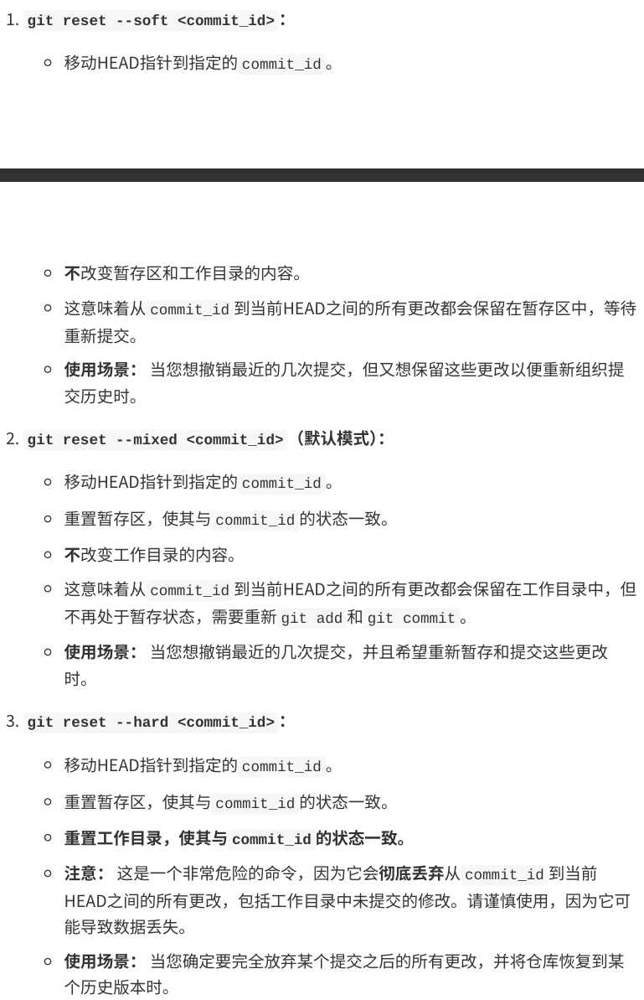

### 分支管理

- 分⽀是Git中最强⼤的功能之⼀，也是Git区别于其他版本控制系统的核⼼优势

#### 什么是分支

- 在Git中，分⽀本质上是⼀个指向某个提交（commit）的指针。当您创建⼀个新的分⽀时， Git并不会复制整个代码库，⽽只是创建⼀个新的指针，指向当前的提交

- 默认情况下，Git仓库会有⼀个名为 master （或 main ）的主分⽀。当您进行提交时， master 分⽀的指针会随着新的提交向前移动

- 分⽀的引⼊，使得开发者可以在不影响主线 开发的情况下，独⽴地进⾏新功能开发、bug修复或实验性尝试

#### 创建分支：`git branch`

- `git branch` 命令⽤于创建新的分⽀。创建分⽀后，HEAD指针仍然指向当前所在的分⽀

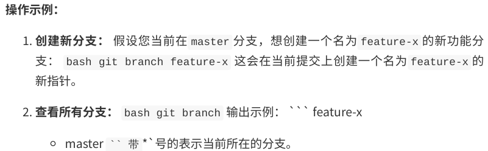

#### 切换分支：`git checkout`

- `git checkout` 命令⽤于切换到指定的分⽀。切换分⽀后，您的⼯作⽬录会更新，以反映新 分⽀所指向的提交状态

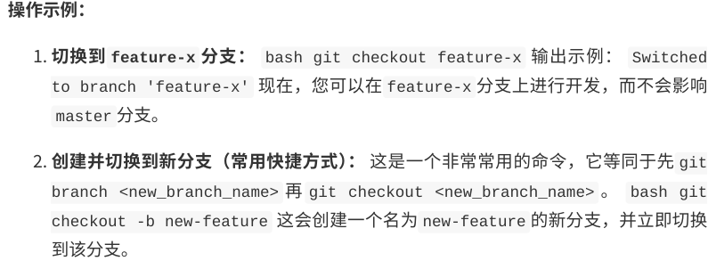

#### 合并分支：`git merge`

- 当您在⼀个分⽀上完成了开发⼯作后，通常需要将该分⽀的更改合并回主分⽀（或其他⽬标 分⽀）。 `git merge` 命令⽤于将⼀个或多个分⽀的更改合并到当前所在的分⽀

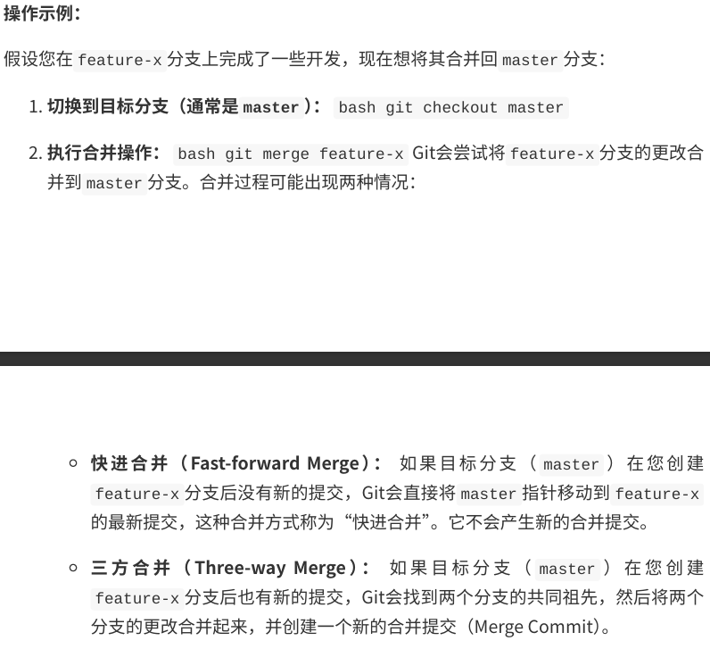

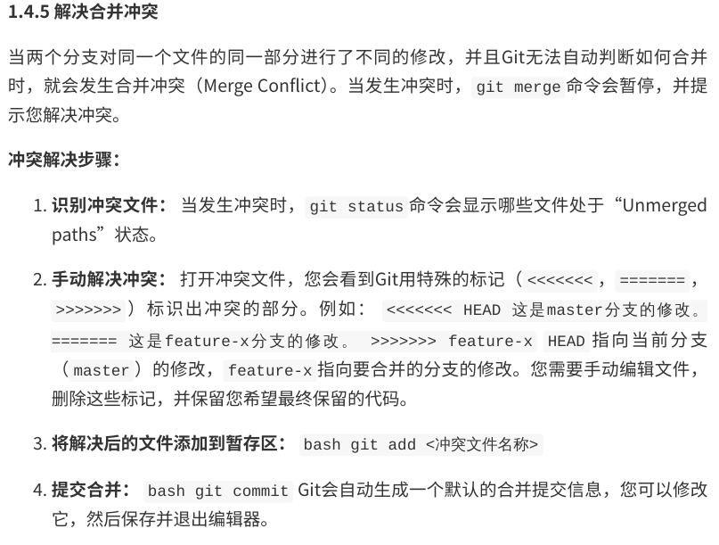

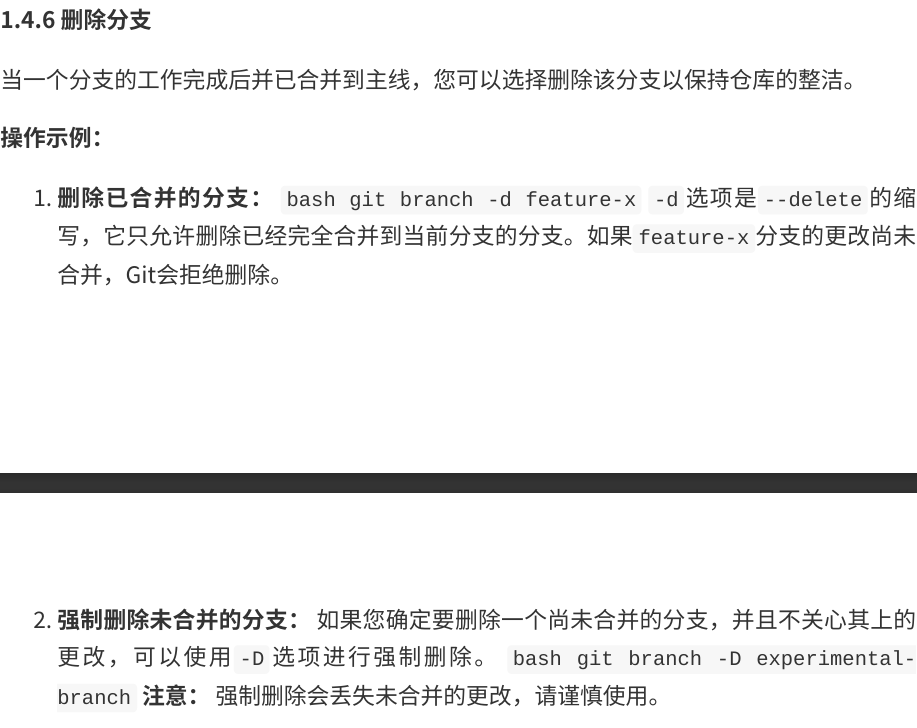

### 远程仓库

- 远程仓库是Git的另⼀个核⼼概念，它允许团队成员之间共享代码，并进⾏协作开发

#### 什么是远程仓库

远程仓库（Remote Repository）是托管在⽹络上的Git仓库，它与本地仓库（Local Repository）相对应

当您克隆⼀个远程仓库时，Git会⾃动将其命名为 `origin` ，这是Git默认的远程仓库名称。

#### 添加远程仓库： `git remote add` 

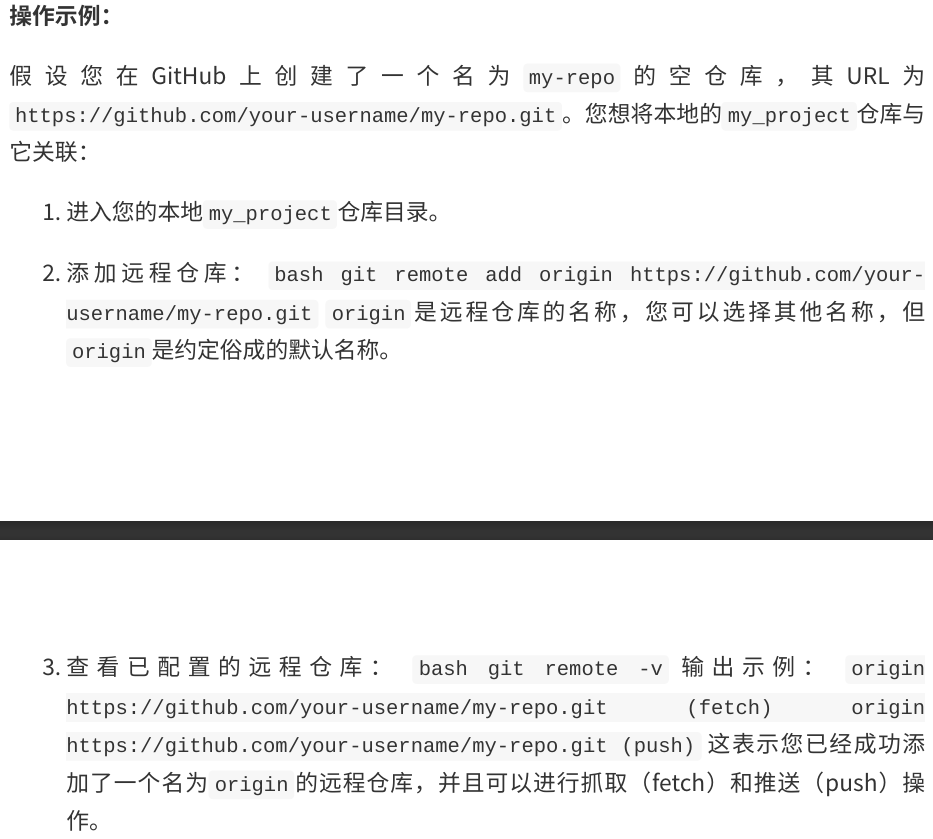

#### 克隆远程仓库：`git clone`

`git clone` 命令⽤于从远程仓库复制⼀个完整的副本到本地。这通常是您开始参与⼀个现 有项⽬的第⼀步。克隆操作会⾃动将远程仓库设置为本地仓库的`origin`，并下载所有分支的历史记录

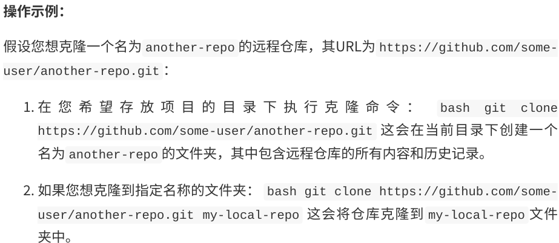

#### 推送本地修改：`git push`

当您在本地仓库中进⾏了提交后，如果希望将这些更改分享给团队成员或保存到远程仓库， 就需要使⽤ `git push` 命令

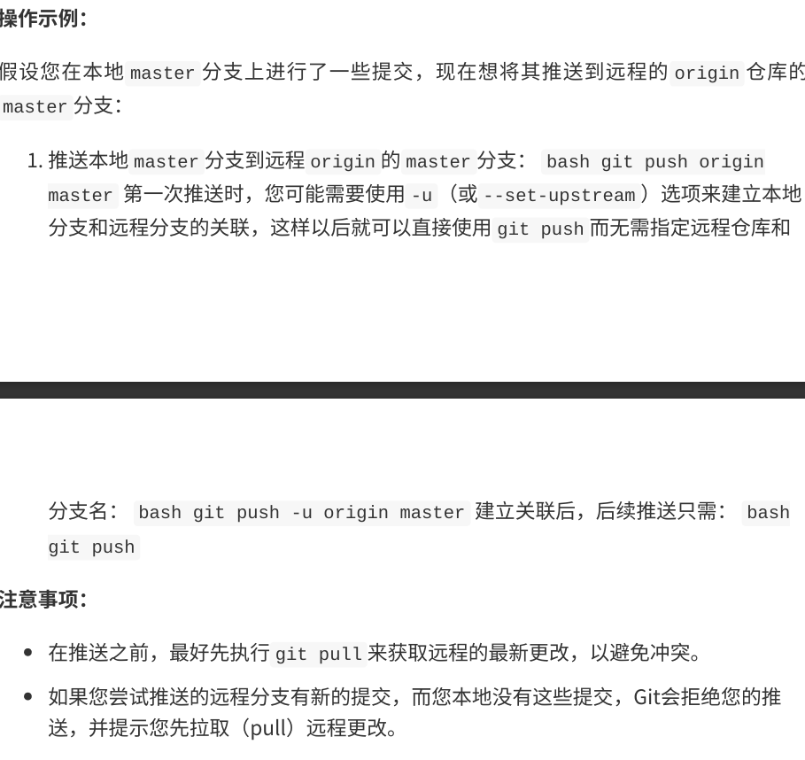

#### 拉取远程修改：`git pull`/`git fetch`

当团队成员在远程仓库中提交了新的更改时，您需要将这些更改同步到您的本地仓库。Git 提供了两种主要的⽅式来获取远程更改： `git fetch` 和 `git pull` 。

##### `git fetch` ：获取远程更改但不合并

`git fetch` 命令会从远程仓库下载最新的提交历史，但不会⾃动合并到您当前的⼯作分 ⽀。它会将远程分⽀的最新状态更新到本地的远程跟踪分⽀（例如 `origin/master` ）

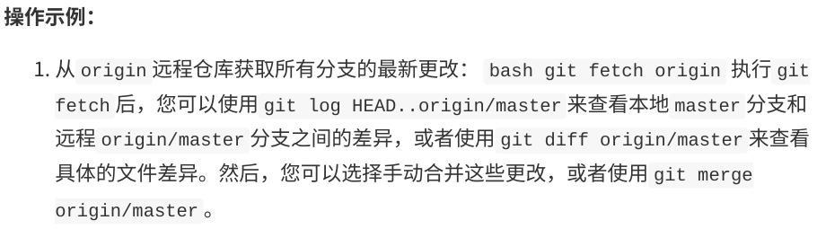

##### `git pull` ：获取远程更改并合并

`git pull` 命令是 `git fetch` 和 `git merge` 的组合。它会从远程仓库下载最新的提交历 史，并⾃动将其合并到您当前的⼯作分⽀

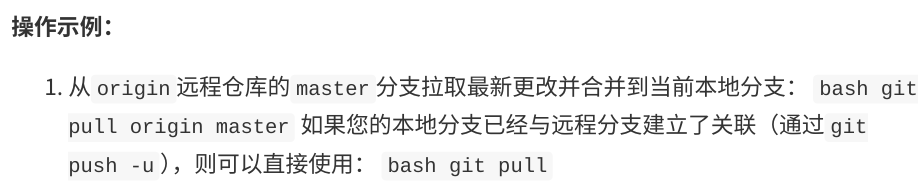

##### `git pull`和`git fetch`的选择

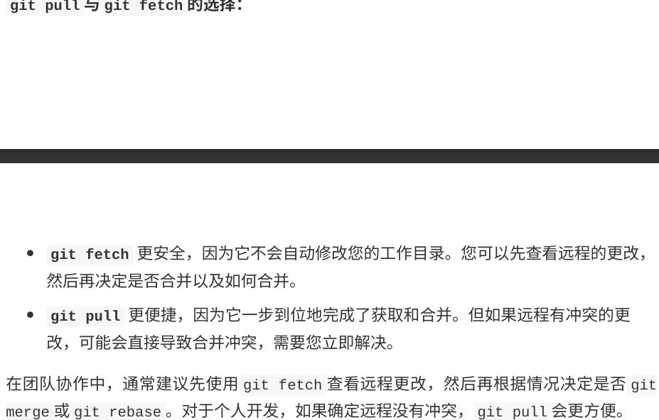

在团队协作中，通常建议先使⽤ `git fetch` 查看远程更改，然后再根据情况决定是否 `git merge` 或 `git rebase` 。对于个⼈开发，如果确定远程没有冲突， `git pull` 会更⽅便。

## github实践

GitHub的核⼼功能 GitHub提供了丰富的功能来⽀持软件开发和协作，其中⼀些核⼼功能包括：

- 仓库（Repositories）： 存储项⽬代码、⽂件和所有版本历史的地⽅。每个项⽬通常 对应⼀个仓库。

- 分⽀（Branches）： 与Git中的分⽀概念⼀致，允许开发者在不影响主线代码的情况下 独⽴开发新功能或修复bug。

- 提交（Commits）： 记录代码变更的快照，包含提交信息、作者、时间等。

- 拉取请求（Pull Requests，PRs）： 开发者在⾃⼰的分⽀上完成⼯作后，向主仓库发 起合并请求，请求将⾃⼰的更改合并到主分⽀。这是GitHub上进⾏代码审查和协作的 核⼼机制。

- 问题（Issues）： ⽤于跟踪任务、bug、功能请求和讨论。团队成员可以在这⾥提出问 题、分配任务、讨论解决⽅案。

- 维基（Wikis）： 为项⽬提供⽂档和知识库。

- 项⽬（Projects）： 提供看板式（Kanban-style）的项⽬管理⼯具，帮助团队组织和 跟踪⼯作。

- Actions： ⾃动化⼯作流，例如持续集成/持续部署（CI/CD）、⾃动化测试等。

- Pages： 免费托管静态⽹站，通常⽤于项⽬⽂档、个⼈博客或演⽰⻚⾯。

- Gist： 简单地分享代码⽚段或笔记。

### 协作流程

#### Fork仓库

Fork（派⽣）是GitHub上进⾏协作的第⼀步，尤其是在您想为别⼈的开源项⽬贡献代码， 但⼜没有直接写⼊权限时。当您Fork⼀个仓库时，GitHub会在您的账⼾下创建⼀个该仓库 的完整副本。这个副本是独⽴的，您可以随意修改，⽽不会影响到原始仓库

#### Pull Request（PR）流程

Pull Request（拉取请求，简称PR）是GitHub上进⾏代码合并和代码审查的核⼼机制。当 您在⾃⼰的Fork仓库或特性分⽀上完成了⼀项功能开发或bug修复后，您可以通过PR向原始 仓库的维护者提出请求，希望将您的更改合并到他们的项⽬中。

##### PR工作流程

1. fork原始仓库
2. git clone 克隆仓库到本地
3. 添加原始仓库为远程上游：允许从原始仓库同步最新的修改
4. 创建新分支进行开发
5. 进行修改和提交
6. 将修改后的分支提交到fork仓库：git push origin xxx(分支名)
7. 创建Pull Request：点击”Compare & pull request“

#### Code Review

仓库维护者和其他贡献者进行审查，无需提交新的pr，只需要再次推送即可

### 一些高级操作

#### GitHub Actions

GitHub Actions是GitHub提供的⼀项持续集成/持续部署（CI/CD）服务，它允许您在 GitHub仓库中⾃动化、⾃定义和执⾏软件开发⼯作流程。您可以编写⼯作流（workflows） 来构建、测试、部署代码，或者执⾏任何您想在代码仓库事件（如push、pull request、 issue创建等）发⽣时⾃动运⾏的任务

#### GitHub Gist

#### Github Pages

#### GitHub Copilot

### commit的规范

```bash
<type>(<scope>): <subject>
<body>
<footer>
```

- <type>：表示本次提交的类型

  - feat：新功能（feature）
  - fix：修复bug
  - docs：文档
  - style：格式
  - refactor：重构（既不是新功能也不是bug修复的代码变动）
  - pref：性能优化
  - test：增加测试
  - build：构建过程或辅助工具的变动

- <scope>：表示本次提交影响的范围
- <subject>：提交的简短描述

- <footer>： 可选，可以包含Breaking Changes、关闭的Issue等信息。