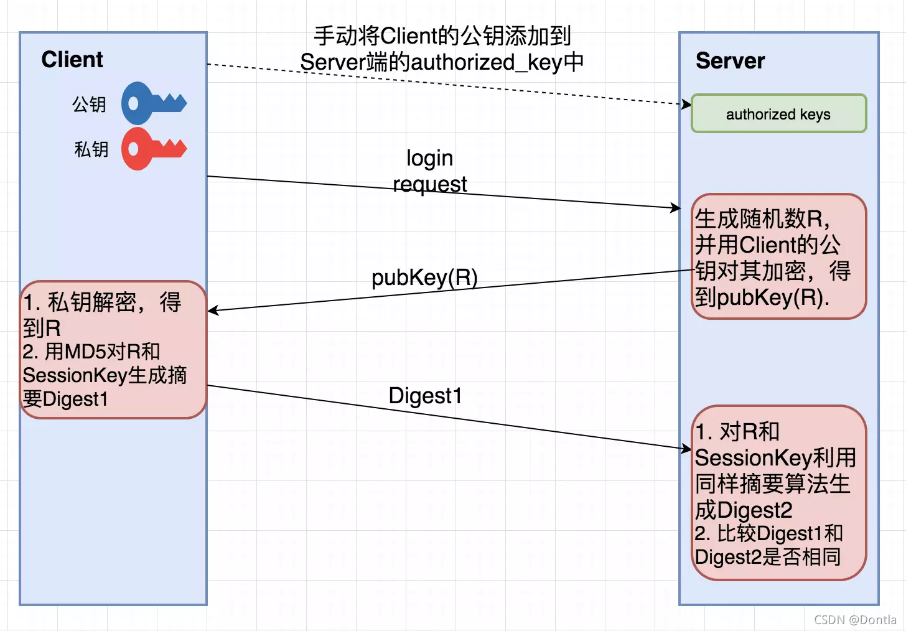

## ssh概念

- SSH，全称Secure Shell，意为“安全外壳协议”

- 一种加密的网络协议，用于在不安全的网络中安全地执行网络服务

- 最常见的用途是远程登录到服务器，执行命令，以及在客户端和服务器之间安全地传输文件

## 工作原理

当用户尝试通过SSH连接到远程服务器时，会发生以下主要步骤：

1. 连接建立：SSH客户端向SSH服务器发起连接请求。服务器会响应并发送其公钥给客户端。

2. 密钥交换与加密协商：客户端接收到服务器的公钥后，会生成一个随机的会话密钥，并使用服务器的公钥对其进行加密，然后发送给服务器。服务器使用其私钥解密会话密钥。至此，客户端和服务器都拥有相同的会话密钥。此后，所有通信都将使用这个会话密钥进行对称加密。

3. 身份认证：客户端需要向服务器证明自己的身份。这可以通过以下两种主要方式实现：

- 密码认证：客户端发送用户名和密码给服务器。服务器验证这些凭据。如果匹配，则认证成功。

- 密钥认证：客户端向服务器发送其公钥的指纹。服务器在 `~/.ssh/authorized_keys` 文件中查找匹配的公钥。如果找到，服务器会生成一个随机字符串并使用客户端的公钥加密，然后发送给客户端。客户端使用其私钥解密该字符串，并将其发送回服务器。服务器验证解密后的字符串是否与原始字符串匹配。如果匹配，则认证成功。这种方式通常更安全，因为它不需要在网络上传输密码。

4. 会话建立：认证成功后，SSH会话正式建立。用户可以在客户端通过加密通道安全地执行命令、传输文件等操作。

感觉单看文字看不懂，就又去搜了一下其他带图解的教程，这个讲的就挺清晰的[超详细的图解SSH原理（真的超详细哦~~~~~~~~~）-CSDN博客](https://blog.csdn.net/wang_qiu_hao/article/details/127902007)

核心就是这张图



相当于client自己有公私钥，公钥扔出去，私钥自己保留，最后靠着同有的随机数R和SeeionKey来进行验证

## 连接方法

### 基本连接

指令：`ssh [username]@[hostname_or_ip]`

- `username`：你在远程服务器上的用户名。例如，如果你要连接到一台Linux服务器，通常会使用`root`、`ubuntu`、`centos`等用户名，或者你在服务器上创建的普通用户。

- `hostname\_or\_ip`：远程服务器的IP地址（例如：`192.168.1.100`）或主机名（例如：`example.com`）。

**示例：**

假设你要连接到IP地址为192.168.1.100的服务器，并使用用户名为myuser登录，命令如下：

```bash
ssh myuser@192.168.1.100
```


如果你是第一次连接这台服务器，系统会提示你确认服务器的真实性。这是SSH为了防止“中间人攻击”而设计的安全机制。你会看到类似以下的信息：

```plaintext
The authenticity of host '192.168.1.100 (192.168.1.100)' can't be established.
ECDSA key fingerprint is SHA256:xxxxxxxxxxxxxxxxxxxxxxxxxxxxxxxxxxxxxxxxxxx.
Are you sure you want to continue connecting (yes/no/[fingerprint])?
```

输入yes并按回车，服务器的公钥指纹将被添加到你的`~/.ssh/known_hosts`文件中。此后再次连接时，就不会再出现此提示。如果服务器的公钥指纹发生变化，SSH会发出警告，这可能意味着服务器的身份被冒充，或者服务器的操作系统被重新安装过。

### 指定端口连接

指令：`ssh -p [port] [username]@[hostname_or_ip]`

默认情况下，SSH服务器监听22端口。但出于安全考虑，许多服务器管理员会将SSH服务配置在非标准端口上。在这种情况下，你需要使用-p选项来指定端口号

- `-p [port]`：指定SSH连接的端口号。例如，如果SSH服务在2222端口上运行，则使用`-p 2222`。

**示例：**

假设你要连接到IP地址为192.168.1.100的服务器，使用用户名为myuser，并且SSH服务运行在2222端口，命令如下：

```bash
ssh -p 2222 myuser@192.168.1.100
```

### 密码认证

当你执行SSH连接命令后，如果服务器配置为允许密码认证，系统会提示你输入密码：

```bash
myuser@192.168.1.100's password:
```

输入你在远程服务器上myuser的密码，然后按回车。请注意，当你输入密码时，屏幕上不会显示任何字符（包括星号），这是正常的安全行为。如果密码正确，你将成功登录到远程服务器的命令行界面。

因此，在生产环境中，强烈建议使用更安全的SSH密钥认证方式，即免密登录

## 密钥认证（免密登录）

- SSH密钥认证是比密码认证更安全、更便捷的登录方式。它基于非对称加密原理，使用一对密钥：一个公钥（public key）和一个私钥（private key）。

- 公钥可以公开，而私钥必须严格保密。当你使用密钥认证登录时，服务器会使用你的公钥来验证你的身份，而无需输入密码

生成SSH密钥对的指令：`ssh-keygen`

在你的本地机器（客户端）上，使用ssh-keygen命令来生成SSH密钥对。默认情况下，它会生成RSA算法的密钥对

执行此命令后，系统会提示你：

1. **Enter file in which to save the key (/home/your_user/.ssh/id_rsa):**

    这是密钥文件的保存路径。默认路径是用户主目录下的`.ssh`隐藏文件夹，文件名为`id_rsa`（私钥）和`id_rsa.pub`（公钥）。通常情况下，直接按回车接受默认路径即可。

2. **Enter passphrase (empty for no passphrase):**

    这是为你的私钥设置一个密码短语（passphrase）。设置密码短语可以增加私钥的安全性，即使私钥被盗，没有密码短语也无法使用。如果你希望实现完全的免密登录，可以直接按回车留空。但为了更高的安全性，建议设置一个强密码短语。如果你设置了密码短语，每次使用私钥时都需要输入它。

3. **Enter same passphrase again:**

    再次输入密码短语进行确认。

成功生成密钥对后，你会在\~/.ssh/目录下看到两个文件：

- id\_rsa：你的私钥文件。请务必妥善保管，不要泄露给任何人。

- id\_rsa.pub：你的公钥文件。这个文件可以安全地分享给需要连接的服务器。

### 公钥与私钥

- 公钥（Public Key）：用于加密数据和验证数字签名。你可以将其放置在任何你想要通过SSH连接的服务器上。当服务器收到连接请求时，它会使用你的公钥来验证你的身份。

- 私钥（Private Key）：用于解密数据和生成数字签名。它必须保存在你的本地机器上，并且只有你自己可以访问。私钥是SSH密钥认证的核心，它的安全至关重要。

### 将公钥复制到服务器：`ssh-copy-id` 或手动复制到 `~/.ssh/authorized\_keys`

为了让服务器信任你的公钥，你需要将你的公钥（`id_rsa.pub`的内容）添加到远程服务器上对应用户的`~/.ssh/authorized_keys`文件中。

#### 方法一：使用ssh-copy-id（推荐）

`ssh-copy-id`是一个非常方便的工具，它可以自动将你的公钥复制到远程服务器的`authorized\_keys`文件中，并设置正确的权限。这是最推荐的方法。

```bash
ssh-copy-id [username]@[hostname_or_ip]
```

执行此命令后，它会提示你输入远程服务器上`myuser`的密码。输入正确密码后，你的公钥就会被添加到服务器的`/.ssh/authorized_keys`文件中。如果`/.ssh`目录或`authorized_keys`文件不存在，`ssh-copy-id`也会自动创建并设置正确的权限

#### 方法二：手动复制

如果你的系统没有`ssh-copy-id`命令，或者你更喜欢手动操作，可以通过以下步骤完成：

1.在本地机器上查看公钥内容：

2.登录到远程服务器：使用密码认证方式登录到远程服务器。

3.创建或编辑`authorized\_keys`文件：在远程服务器上，确保`~/.ssh`目录存在，并且权限正确（通常是`700`）。如果不存在，请创建它：

#### 使用密钥连接

完成公钥的复制后，你就可以尝试使用密钥进行连接了。如果一切配置正确，你将无需输入密码即可直接登录

```bash
ssh myuser@192.168.1.100
```

如果你的私钥设置了密码短语，系统会提示你输入私钥的密码短语。如果私钥没有设置密码短语，你将直接登录成功。

**故障排除提示：**

- 如果无法通过密钥登录，请检查服务器上`~/.ssh`目录和`authorized_keys`文件的权限。它们必须是严格的，否则SSH服务器会拒绝使用。

- 检查SSH服务器的`sshd_config`文件，确保`PubkeyAuthentication yes`已启用。

- 确保你使用的私钥与服务器上的公钥是匹配的。

密钥认证是SSH最强大和安全的特性之一，强烈建议在所有生产环境中使用它。

## 实际操作

### 1. 基本密码认证连接

这是最简单的连接方式，使用用户名和密码登录。

```bash
# 将 myuser 和 192.168.1.100 替换为您的用户名和服务器IP地址
ssh myuser@192.168.1.100

# 如果SSH服务运行在非标准端口（例如2222），请使用 -p 选项
ssh -p 2222 myuser@192.168.1.100
```

执行命令后，系统会提示您输入密码。输入正确的密码后即可登录。

### 2. 生成SSH密钥对

在您的本地计算机上执行此操作，以创建用于免密登录的密钥。

```bash
# 生成一个新的SSH密钥对
ssh-keygen -t rsa -b 4096 -C "your_email@example.com"

# 您可以一路按回车使用默认设置
# 建议为私钥设置一个安全的密码短语（passphrase）
```

这将在您的 `~/.ssh/`目录下创建 `id_rsa` (私钥) 和 `id_rsa.pub` (公钥) 两个文件。

### 3. 将公钥复制到远程服务器

为了实现免密登录，您需要将您的公钥 (`id_rsa.pub`) 的内容添加到远程服务器的 `~/.ssh/authorized_keys` 文件中。

推荐使用 `ssh-copy-id` 命令：

```bash
# 将公钥自动复制到远程服务器
ssh-copy-id myuser@192.168.1.100
```

系统会提示您输入一次密码，之后您的公钥就会被添加到服务器上。

如果无法使用 `ssh-copy-id`，可以手动复制：

```bash
# 1. 在本地计算机上，显示并复制公钥内容
cat ~/.ssh/id_rsa.pub

# 2. 通过密码登录到远程服务器
ssh myuser@192.168.1.100

# 3. 在远程服务器上，将公钥内容追加到 authorized_keys 文件
mkdir -p ~/.ssh
echo "在此处粘贴您复制的公钥内容" >> ~/.ssh/authorized_keys

# 4. 设置正确的文件权限
chmod 700 ~/.ssh
chmod 600 ~/.ssh/authorized_keys

# 5. 退出远程服务器
exit
```

### 4. 使用密钥进行免密登录

完成上述步骤后，您就可以在不输入密码的情况下连接到远程服务器了。

```bash
# 现在连接时，将不再提示输入密码
ssh myuser@192.168.1.100
```

如果您为私钥设置了密码短语，系统会提示您输入该密码短语。

### 5. 使用SSH配置文件简化连接

在您的本地计算机上，编辑 `~/.ssh/config` 文件，为您的连接创建一个别名。

```plaintext
# ~/.ssh/config 文件内容示例

Host myserver
    HostName 192.168.1.100
    User myuser
    Port 22
    IdentityFile ~/.ssh/id_rsa
```

现在，您可以使用更简单的命令进行连接：

```bash
ssh myserver
```

## 注

还有一些高级操作没学，看到时候会用到什么再来考虑，记录可以直接到manus这里来找