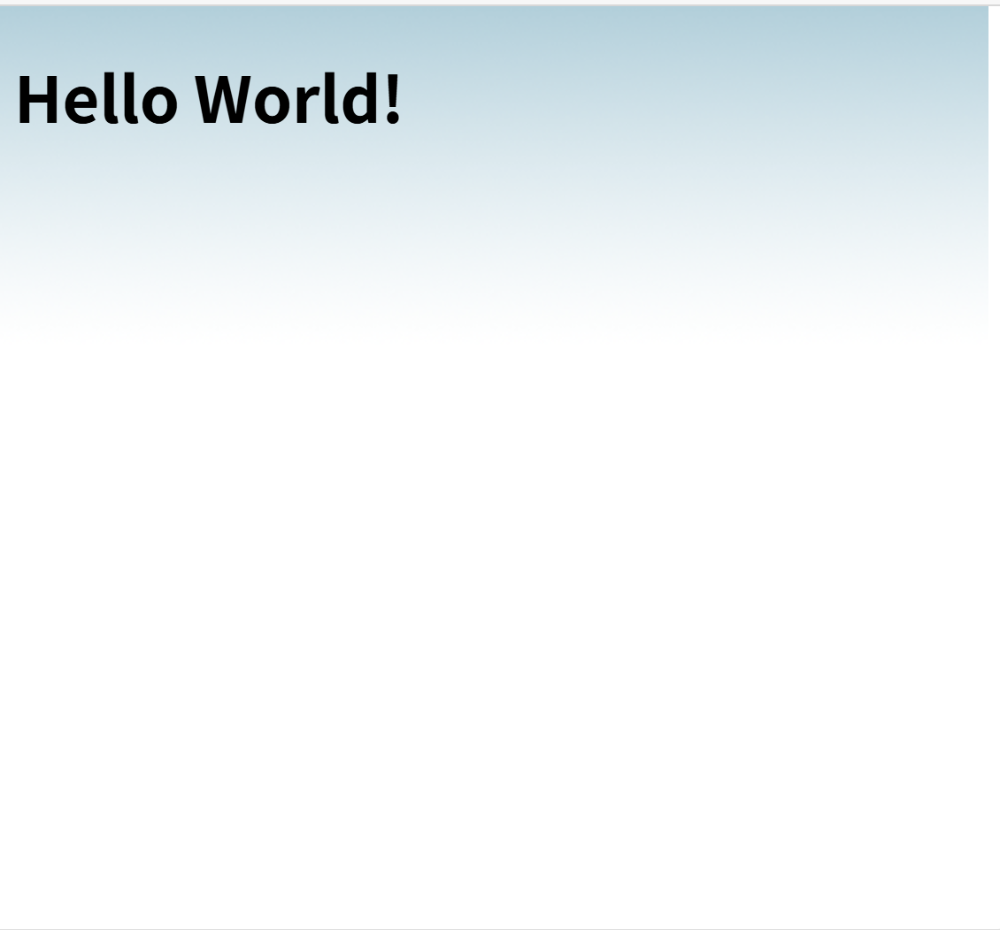
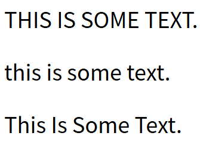
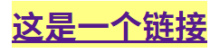

## CSS 背景

CSS 背景属性用于定义HTML元素的背景。

CSS 属性定义背景效果:

- background-color
- background-image
- background-repeat
- background-attachment
- background-position

### 背景颜色

background-color 属性定义了元素的背景颜色.

页面的背景颜色使用在body的选择器中:

```css
body {background-color:#b0c4de;}
```

CSS中，颜色值通常以以下方式定义:

- 十六进制 - 如："#ff0000"
- RGB - 如："rgb(255,0,0)"
- 颜色名称 - 如："red"

以下实例中, h1, p, 和 div 元素拥有不同的背景颜色:

```css
h1 {background-color:#6495ed;}
p {background-color:#e0ffff;}
div {background-color:#b0c4de;}
```


### 背景图像

background-image 属性描述了元素的背景图像.

默认情况下，背景图像进行平铺重复显示，以覆盖整个元素实体.

页面背景图片设置实例:

```css
body {background-image:url('paper.gif');}
```

#### 水平或垂直平铺

默认情况下 background-image 属性会在页面的水平或者垂直方向平铺。

一些图像如果在水平方向与垂直方向平铺，这样看起来很不协调，如下所示:

```css
body
{
background-image:url('gradient2.png');
}
```

呈现结果为：


但如果图像只在水平方向平铺 (repeat-x), 页面背景会更好些:

```css
body
{
background-image:url('gradient2.png');
background-repeat:repeat-x;
}
```

呈现结果为：




#### 设置定位与不平铺

如何让背景图像不影响文本的排版

如果你不想让图像平铺，你可以使用 background-repeat 属性:

```css
body
{
background-image:url('img_tree.png');
background-repeat:no-repeat;
}
```

呈现结果如下：


以上实例中，背景图像与文本显示在同一个位置，为了让页面排版更加合理，不影响文本的阅读，我们可以改变图像的位置。

可以利用 background-position 属性改变图像在背景中的位置:

```css
body
{
background-image:url('img_tree.png');
background-repeat:no-repeat;
background-position:right top;
}
```

呈现结果如下：


#### 简写属性

在以上实例中我们可以看到页面的背景颜色通过了很多的属性来控制。

为了简化这些属性的代码，我们可以将这些属性合并在同一个属性中.

背景颜色的简写属性为 "background":

```css
body {background:#ffffff url('img_tree.png') no-repeat right top;}
```

当使用简写属性时，属性值的顺序为：

- background-color
- background-image
- background-repeat
- background-attachment
- background-position

以上属性无需全部使用，你可以按照页面的实际需要使用

## 文本格式

### 文本颜色

颜色属性被用来设置文字的颜色。

颜色是通过CSS最经常的指定：

- 十六进制值 - 如:  **＃FF0000**
- 一个RGB值 - 如: **RGB(255,0,0)**
- 颜色的名称 - 如: **red**

参阅 [CSS 颜色值](https://www.runoob.com/cssref/css-colors-legal.html) 查看完整的颜色值。

### 文本的对齐方式

文本排列属性是用来设置文本的水平对齐方式。

文本可居中或对齐到左或右,两端对齐.

当text-align设置为"justify"，每一行被展开为宽度相等，左，右外边距是对齐（如杂志和报纸）。

还可以设置成`center`，这样是居中，还可以设置成`right`或`left`,分别是右对齐和左对齐

### 文本修饰

text-decoration 属性用来设置或删除文本的装饰。

从设计的角度看 text-decoration属性主要是用来删除链接的下划线：

```css
a {text-decoration:none;}
```

这样就删除了链接的下划线

也可以这样装饰文字：

```css
h1 {text-decoration:overline;}
h2 {text-decoration:line-through;}
h3 {text-decoration:underline;}
```

呈现效果如下：


### 文本转换

文本转换属性是用来指定在一个文本中的大写和小写字母。

可用于所有字句变成大写或小写字母，或每个单词的首字母大写

```css
p.uppercase {text-transform:uppercase;}
p.lowercase {text-transform:lowercase;}
p.capitalize {text-transform:capitalize;}
```

对应结果如下：全大写/全小写/首字母大写



### 文本缩进

文本缩进属性是用来指定文本的第一行的缩进。

```css
p {text-indent:50px;}
```


## CSS 字体

CSS字体属性定义字体，加粗，大小，文字样式。

### CSS字型

在CSS中，有两种类型的字体系列名称：

- **通用字体系列** - 拥有相似外观的字体系统组合（如 "Serif" 或 "Monospace"）
- **特定字体系列** - 一个特定的字体系列（如 "Times" 或 "Courier"）

| Generic family | 字体系列                    | 说明                                        |
| :--------------- | :---------------------------- | :-------------------------------------------- |
| Serif          | Times New Roman<br />Georgia    | Serif字体中字符在行的末端拥有额外的装饰     |
| Sans-serif     | Arial<br />Verdana              | "Sans"是指无 - 这些字体在末端没有额外的装饰 |
| Monospace      | Courier New<br />Lucida Console | 所有的等宽字符具有相同的宽度                |

### 字体系列

font-family 属性设置文本的字体系列。

font-family 属性应该设置几个字体名称作为一种"后备"机制，如果浏览器不支持第一种字体，他将尝试下一种字体。

**注意**: 如果字体系列的名称超过一个字，它必须用引号，如Font Family："宋体"。

多个字体系列是用一个逗号分隔指明：

```css
p{font-family:"Times New Roman", Times, serif;}
```

对于较常用的字体组合，看看我们的 [Web安全字体组合](https://www.runoob.com/cssref/css-websafe-fonts.html)。

### 字体样式

主要是用于指定斜体文字的字体样式属性。

这个属性有三个值：

- 正常 - 正常显示文本
- 斜体 - 以斜体字显示的文字
- 倾斜的文字 - 文字向一边倾斜（和斜体非常类似，但不太支持）

```css
p.normal {font-style:normal;}
p.italic {font-style:italic;}
p.oblique {font-style:oblique;}
```

### 字体大小

font-size 属性设置文本的大小。

能否管理文字的大小，在网页设计中是非常重要的。但是，你不能通过调整字体大小使段落看上去像标题，或者使标题看上去像段落。

请务必使用正确的HTML标签，就\<h1\> - \<h6\>表示标题和\<p\>表示段落：

字体大小的值可以是绝对或相对的大小。

绝对大小：

- 设置一个指定大小的文本
- 不允许用户在所有浏览器中改变文本大小
- 确定了输出的物理尺寸时绝对大小很有用

相对大小：

- 相对于周围的元素来设置大小
- 允许用户在浏览器中改变文字大小

注：如果你不指定一个字体的大小，默认大小和普通文本段落一样，是16像素（16px=1em）。

### 设置字体大小像素

设置文字的大小与像素，让您完全控制文字大小：

```css
h1 {font-size:40px;}
h2 {font-size:30px;}
p {font-size:14px;}
```

上面的例子可以在 Internet Explorer 9, Firefox, Chrome, Opera, 和 Safari 中通过缩放浏览器调整文本大小。

虽然可以通过浏览器的缩放工具调整文本大小，但是，这种调整是整个页面，而不仅仅是文本

### 用em来设置字体大小

为了避免Internet Explorer 中无法调整文本的问题，许多开发者使用 em 单位代替像素。

em的尺寸单位由W3C建议。

1em和当前字体大小相等。在浏览器中默认的文字大小是16px。

因此，1em的默认大小是16px。可以通过下面这个公式将像素转换为em：px/16\=em

```css
h1 {font-size:2.5em;} /* 40px/16=2.5em */
h2 {font-size:1.875em;} /* 30px/16=1.875em */
p {font-size:0.875em;} /* 14px/16=0.875em */
```

在上面的例子，em的文字大小是与前面的例子中像素一样。不过，如果使用 em 单位，则可以在所有浏览器中调整文本大小。

不幸的是，仍然是IE浏览器的问题。调整文本的大小时，会比正常的尺寸更大或更小。

## 使用百分比和EM组合

在所有浏览器的解决方案中，设置 \<body\>元素的默认字体大小的是百分比

```css
body {font-size:100%;}
h1 {font-size:2.5em;}
h2 {font-size:1.875em;}
p {font-size:0.875em;}
```

我们的代码非常有效。在所有浏览器中，可以显示相同的文本大小，并允许所有浏览器缩放文本的大小。

body会调所有的字，相当于全图的比例缩放

## CSS 链接

### 链接样式

链接的样式，可以用任何CSS属性（如颜色，字体，背景等）。

特别的链接，可以有不同的样式，这取决于他们是什么状态。

这四个链接状态是：

- a:link - 正常，未访问过的链接
- a:visited - 用户已访问过的链接
- a:hover - 当用户鼠标放在链接上时
- a:active - 链接被点击的那一刻

```css
a:link {color:#000000;}      /* 未访问链接*/
a:visited {color:#00FF00;}  /* 已访问链接 */
a:hover {color:#FF00FF;}  /* 鼠标移动到链接上 */
a:active {color:#0000FF;}  /* 鼠标点击时 */
```

当设置为若干链路状态的样式，也有一些顺序规则：

- a:hover 必须跟在 a:link 和 a:visited后面
- a:active 必须跟在 a:hover后面

### 常见的链接样式

根据上述链接的颜色变化的例子，看它是在什么状态。

让我们通过一些其他常见的方式转到链接样式：

#### 文本修饰

text-decoration 属性主要用于删除链接中的下划线：

```css
a:link {text-decoration:none;}
a:visited {text-decoration:none;}
a:hover {text-decoration:underline;}
a:active {text-decoration:underline;}
```

#### 背景颜色

背景颜色属性指定链接背景色

```css
a:link {background-color:#B2FF99;}
a:visited {background-color:#FFFF85;}
a:hover {background-color:#FF704D;}
a:active {background-color:#FF704D;}
```

呈现效果为：

