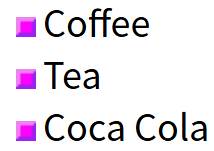

## CSS 列表

CSS 列表属性作用如下：

- 设置不同的列表项标记为有序列表
- 设置不同的列表项标记为无序列表
- 设置列表项标记为图像

在 HTML中，有两种类型的列表：

- 无序列表 ul - 列表项标记用特殊图形（如小黑点、小方框等）
- 有序列表 ol - 列表项的标记有数字或字母

使用 CSS，可以列出进一步的样式，并可用图像作列表项标记。

### 不同的列表项标记

list-style-type属性指定列表项标记的类型是：

```css
ul.a {list-style-type: circle;}  /*这个效果是空心的点*/
ul.b {list-style-type: square;}  /*这个效果是实心的点*/
 
ol.c {list-style-type: upper-roman;}  /*这个效果是希腊字母的I Ⅱ Ⅲ*/
ol.d {list-style-type: lower-alpha;}  /*这个效果是英文字母的a b c*/
```

### 作为列表项标记的图像

要指定列表项标记的图像，使用列表样式图像属性：

```css
ul
{
    list-style-image: url('sqpurple.gif');
}
```

呈现效果如下：



但上面的例子在所有浏览器中显示并不相同，IE 和 Opera 显示图像标记比火狐，Chrome 和 Safari更高一点点。

如果你想在所有的浏览器放置同样的形象标志，就应使用浏览器兼容性解决方案，过程如下

### 浏览器兼容性解决方案

同样在所有的浏览器，下面的例子会显示的图像标记：

```css
ul
{
    list-style-type: none; /*移除默认的列表项目标记*/
    padding: 0px;   /*元素内容与边框之间的内边距*/
    margin: 0px;   /*元素边框之外的外边距，即元素与相邻元素之间的距离*/
}
ul li
{
    background-image: url(sqpurple.gif); /*设置元素的背景图片*/
    background-repeat: no-repeat; /*背景图片不重复，只显示一次*/
    background-position: 0px 5px;  /*设置背景图片的初始位置 第一个值 (0px) 是水平位置 第二个值 (5px) 是垂直位置*/
    padding-left: 14px;  /*设置元素内容与左边框之间的内边距*/
}
```

例子解释：

- ul:

  - 设置列表类型为没有列表项标记
  - 设置填充和边距 0px（浏览器兼容性）
- ul 中所有 li:

  - 设置图像的 URL，并设置它只显示一次（无重复）
  - 您需要的定位图像位置（左 0px 和上下 5px）
  - 用 padding-left 属性把文本置于列表中

### 列表 - 简写属性

在单个属性中可以指定所有的列表属性。这就是所谓的简写属性。

为列表使用简写属性，列表样式属性设置如下：

```css
ul
{
    list-style: square url("sqpurple.gif");
}
```

可以按顺序设置如下属性：

- list-style-type
- list-style-position (有关说明，请参见下面的CSS属性表)
- list-style-image

如果上述值丢失一个，其余仍在指定的顺序，就没关系。