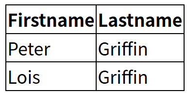
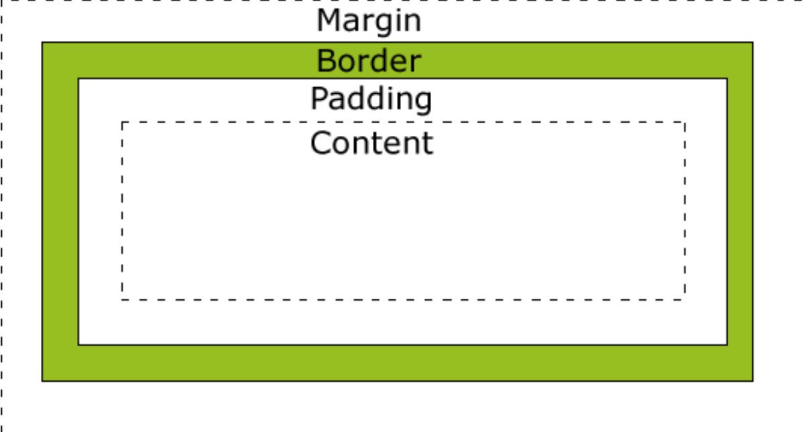

## CSS 表格

使用 CSS 可以使 HTML 表格更美观

### 表格边框

指定CSS表格边框，使用border属性。

下面的例子指定了一个表格的Th和TD元素的黑色边框：

```css
table, th, td
{
    border: 1px solid black;
}
```

呈现效果如下：


在上面的例子中的表格有双边框。这是因为表和th/ td元素有独立的边界。

为了显示一个表的单个边框，使用 border-collapse属性。

### 折叠边框

border-collapse 属性设置表格的边框是否被折叠成一个单一的边框或隔开：

```css
table
{
    border-collapse:collapse;
}
table,th, td
{
    border: 1px solid black;
}
```

呈现效果如：



### 表格宽度和高度

Width和height属性定义表格的宽度和高度。

下面的例子是设置100％的宽度，50像素的th元素的高度的表格：

```css
table 
{
    width:100%;
}
th
{
    height:50px;
}
```

### 表格文字对齐

表格中的文本对齐和垂直对齐属性。

text-align属性设置水平对齐方式，向左，右，或中心：

```css
td
{
    text-align:right; /*可以修改为left，center两种参数*/
}
```

垂直对齐属性设置垂直对齐，比如顶部，底部或中间：

```css
td
{
    height:50px;
    vertical-align:bottom;  /*可以修改为top，middle两种参数*/
}
```

### 表格填充

如需控制边框和表格内容之间的间距，应使用td和th元素的填充属性：

```css
td
{
    padding:15px;
}
```

### 表格颜色

下面的例子指定边框的颜色，和th元素的文本和背景颜色：

```css
table, td, th
{
    border:1px solid green;
}
th
{
    background-color:green;
    color:white;
}
```


## CSS 盒子模型

所有HTML元素可以看作盒子，在CSS中，"box model"这一术语是用来设计和布局时使用。

CSS盒模型本质上是一个盒子，封装周围的HTML元素，它包括：边距，边框，填充，和实际内容。

盒模型允许我们在其它元素和周围元素边框之间的空间放置元素。

下面的图片说明了盒子模型(Box Model)：



不同部分的说明：

- **Margin(外边距)**  - 清除边框外的区域，外边距是透明的。
- **Border(边框)**  - 围绕在内边距和内容外的边框。
- **Padding(内边距)**  - 清除内容周围的区域，内边距是透明的。
- **Content(内容)**  - 盒子的内容，显示文本和图像。

为了正确设置元素在所有浏览器中的宽度和高度，你需要知道的盒模型是如何工作的。

### 元素的宽度和高度

当你指定一个 CSS 元素的宽度和高度属性时，你只是设置内容区域的宽度和高度。要知道，完整大小的元素，你还必须添加内边距，边框和外边距

下面的例子中的元素的总宽度为 450px：

```css
div {
    width: 300px;
    border: 25px solid green;
    padding: 25px;
    margin: 25px;
}
```


## CSS 边框

CSS 边框（Border）是用于定义元素边框样式的属性。

边框可以应用于任何 HTML 元素，用于增强视觉效果、分隔内容或突出显示元素。

CSS 边框属性主要包括边框宽度、边框样式、边框颜色以及简写属性。

### 边框属性

CSS边框属性允许你指定一个元素边框的样式和颜色。

### 边框样式

边框样式属性指定要显示什么样的边界。

border-style 属性用于指定要显示的边框类型。

允许的值如下：

- dotted：定义点状边框。
- dashed：定义虚线边框。
- solid：定义实线边框。
- double：定义双线边框。
- groove：定义三维沟槽边框。效果取决于 border-color 的值。
- ridge：定义三维脊状边框。效果取决于 border-color 的值。
- inset：定义三维嵌入边框。效果取决于 border-color 的值。
- outset：定义三维突出边框。效果取决于 border-color 的值。
- none：定义无边框。
- hidden：定义隐藏边框。

效果可以直接访问[菜鸟教程在线编辑器](https://www.runoob.com/try/try.php?filename=trycss_border-style)来查看

### 边框宽度

您可以通过 border-width 属性为边框指定宽度。

为边框指定宽度有两种方法：可以指定长度值，比如 2px 或 0.1em(单位为 px, pt, cm, em 等)，或者使用 3 个关键字之一，它们分别是 thick 、medium（默认值） 和 thin。

**注意：** CSS 没有定义 3 个关键字的具体宽度，所以一个用户可能把 thick 、medium 和 thin 分别设置为等于 5px、3px 和 2px，而另一个用户则分别设置为 3px、2px 和 1px。

**注意:**  "border-width" 属性 如果单独使用则不起作用。要先使用 "border-style" 属性来设置边框。

### 边框颜色

border-color属性用于设置边框的颜色。可以设置的颜色：

- name - 指定颜色的名称，如 "red"
- RGB - 指定 RGB 值, 如 "rgb(255,0,0)"
- Hex - 指定16进制值, 如 "#ff0000"

您还可以设置边框的颜色为"transparent"。

**注意：**  border-color单独使用是不起作用的，必须得先使用border-style来设置边框样式。

### 单独设置各边

在CSS中，可以指定不同的侧面不同的边框

```css
p
{
    border-top-style:dotted;
    border-right-style:solid;
    border-bottom-style:dotted;
    border-left-style:solid;
}
```

上面的例子也可以设置一个单一属性：

```css
border-style:dotted solid;
```

border-style属性可以有1-4个值：

- **border-style:dotted solid double dashed;**

  - 上边框是 dotted
  - 右边框是 solid
  - 底边框是 double
  - 左边框是 dashed
- **border-style:dotted solid double;**

  - 上边框是 dotted
  - 左、右边框是 solid
  - 底边框是 double
- **border-style:dotted solid;**

  - 上、底边框是 dotted
  - 右、左边框是 solid
- **border-style:dotted;**

  - 四面边框是 dotted

上面的例子用了border-style。然而，它也可以和border-width 、 border-color一起使用。

### 简写属性

上面的例子用了很多属性来设置边框。

你也可以在一个属性中设置边框。

你可以在"border"属性中设置：

- border-width
- border-style (required)
- border-color

## CSS 轮廓（outline）

轮廓（outline）是绘制于元素周围的一条线，位于边框边缘的外围，可起到突出元素的作用。

轮廓（outline）属性指定元素轮廓的样式、颜色和宽度。

没什么好看的[CSS 轮廓（outline）属性 | 菜鸟教程](https://www.runoob.com/css/css-outline.html)

## CSS margin(外边距)

### margin

margin 清除周围的（外边框）元素区域。margin 没有背景颜色，是完全透明的。

margin 可以单独改变元素的上，下，左，右边距，也可以一次改变所有的属性。

没什么好看的[CSS margin(外边距) | 菜鸟教程](https://www.runoob.com/css/css-margin.html)

## CSS padding（填充）

### padding（填充）

当元素的 padding（填充）内边距被清除时，所释放的区域将会受到元素背景颜色的填充。

单独使用 padding 属性可以改变上下左右的填充。

## CSS 分组 和 嵌套 选择器

## 分组选择器

在样式表中有很多具有相同样式的元素。

```css
h1 {
    color:green;
}
h2 {
    color:green;
}
p {
    color:green;
}
```

为了尽量减少代码，你可以使用分组选择器。

每个选择器用逗号分隔。

在下面的例子中，我们对以上代码使用分组选择器：

```css
h1,h2,p
{
    color:green;
}
```

### 嵌套选择器

它可能适用于选择器内部的选择器的样式。

在下面的例子设置了四个样式：

- p{ }: 为所有 **p** 元素指定一个样式。
- .marked{ }: 为所有 **class="marked"**  的元素指定一个样式。
- .marked p{ }: 为所有 **class="marked"**  元素内的 **p** 元素指定一个样式。
- p.marked{ }: 为所有 **class="marked"**  的 **p** 元素指定一个样式。

实现去看这个[菜鸟教程在线编辑器](https://www.runoob.com/try/try.php?filename=trycss_nesting)

## CSS Display(显示) 与 Visibility（可见性）

display属性设置一个元素应如何显示，visibility属性指定一个元素应可见还是隐藏。

### 隐藏元素 - display:none或visibility:hidden

隐藏一个元素可以通过把display属性设置为"none"，或把visibility属性设置为"hidden"。但是请注意，这两种方法会产生不同的结果。

visibility:hidden可以隐藏某个元素，但隐藏的元素仍需占用与未隐藏之前一样的空间。也就是说，该元素虽然被隐藏了，但仍然会影响布局。

display:none可以隐藏某个元素，且隐藏的元素不会占用任何空间。也就是说，该元素不但被隐藏了，而且该元素原本占用的空间也会从页面布局中消失。

### CSS Display - 块和内联元素

块元素是一个元素，占用了全部宽度，在前后都是换行符。

块元素的例子：

- \<h1\>
- \<p\>
- \<div\>

内联元素只需要必要的宽度，不强制换行。

内联元素的例子：

- \<span\>
- \<a\>

## 如何改变一个元素显示

可以更改内联元素和块元素，反之亦然，可以使页面看起来是以一种特定的方式组合，并仍然遵循web标准。

下面的示例把列表项显示为内联元素：

```css
li {display:inline;}
```

下面的示例把span元素作为块元素：

```css
span {display:block;}
```

**注意：** 变更元素的显示类型看该元素是如何显示，它是什么样的元素。例如：一个内联元素设置为display:block是不允许有它内部的嵌套块元素。

## CSS Position(定位)

position 属性指定了元素的定位类型。

position 属性的五个值：

- [static](https://www.runoob.com/css/css-positioning.html#position-static)
- [relative](https://www.runoob.com/css/css-positioning.html#position-relative)
- [fixed](https://www.runoob.com/css/css-positioning.html#position-fixed)
- [absolute](https://www.runoob.com/css/css-positioning.html#position-absolute)
- [sticky](https://www.runoob.com/css/css-positioning.html#position-sticky)

元素可以使用的顶部，底部，左侧和右侧属性定位。然而，这些属性无法工作，除非事先设定position属性。他们也有不同的工作方式，这取决于定位方法。

### static 定位

HTML 元素的默认值，即没有定位，遵循正常的文档流对象。

静态定位的元素不会受到 top, bottom, left, right影响。

```css
div.static {
    position: static;
    border: 3px solid #73AD21;
}
```

### fixed 定位

元素的位置相对于浏览器窗口是固定位置。

即使窗口是滚动的它也不会移动：

```css
p.pos_fixed
{
    position:fixed;
    top:30px;
    right:5px;
}
```

**注意：**  Fixed 定位在 IE7 和 IE8 下需要描述 !DOCTYPE 才能支持。

Fixed定位使元素的位置与文档流无关，因此不占据空间。

Fixed定位的元素和其他元素重叠。

### relative 定位

相对定位元素的定位是相对其正常位置。

```css
h2.pos_left
{
    position:relative;
    left:-20px;
}
h2.pos_right
{
    position:relative;
    left:20px;
}
```

移动相对定位元素，但它原本所占的空间不会改变。

```css
h2.pos_top
{
    position:relative;
    top:-50px;
}
```

相对定位元素经常被用来作为绝对定位元素的容器块。

### absolute 定位

绝对定位的元素的位置相对于最近的已定位父元素，如果元素没有已定位的父元素，那么它的位置相对于\<html\>:

```css
h2
{
    position:absolute;
    left:100px;
    top:150px;
}
```

absolute 定位使元素的位置与文档流无关，因此不占据空间。

absolute 定位的元素和其他元素重叠。

### sticky 定位

sticky 英文字面意思是粘，粘贴，所以可以把它称之为粘性定位。

position: sticky; 基于用户的滚动位置来定位。

粘性定位的元素是依赖于用户的滚动，在 **position:relative** 与 **position:fixed** 定位之间切换。

它的行为就像 **position:relative;**  而当页面滚动超出目标区域时，它的表现就像 **position:fixed;** ，它会固定在目标位置。

元素定位表现为在跨越特定阈值前为相对定位，之后为固定定位。

这个特定阈值指的是 top, right, bottom 或 left 之一，换言之，指定 top, right, bottom 或 left 四个阈值其中之一，才可使粘性定位生效。否则其行为与相对定位相同。

```css
div.sticky {
    position: -webkit-sticky; /* Safari */
    position: sticky;
    top: 0;
    background-color: green;
    border: 2px solid #4CAF50;
}
```


## 重叠的元素

元素的定位与文档流无关，所以它们可以覆盖页面上的其它元素

z-index属性指定了一个元素的堆叠顺序（哪个元素应该放在前面，或后面）

一个元素可以有正数或负数的堆叠顺序：

```css
img
{
    position:absolute;
    left:0px;
    top:0px;
    z-index:-1;
}
```

具有更高堆叠顺序的元素总是在较低的堆叠顺序元素的前面。

**注意：**  如果两个定位元素重叠，没有指定z - index，最后定位在HTML代码中的元素将被显示在最前面。