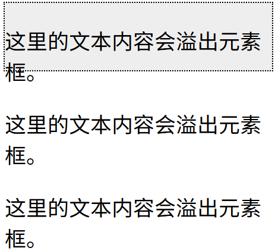

## CSS 布局 - Overflow

CSS overflow 属性用于控制内容溢出元素框时显示的方式。

CSS overflow 属性可以控制内容溢出元素框时在对应的元素区间内添加滚动条。

overflow属性有以下值：

| 值      | 描述                                                     |
| --------- | ---------------------------------------------------------- |
| visible | 默认值。内容不会被修剪，会呈现在元素框之外。             |
| hidden  | 内容会被修剪，并且其余内容是不可见的。                   |
| scroll  | 内容会被修剪，但是浏览器会显示滚动条以便查看其余的内容。 |
| auto    | 如果内容被修剪，则浏览器会显示滚动条以便查看其余的内容。 |
| inherit | 规定应该从父元素继承 overflow 属性的值。                 |

**注意:** overflow 属性只工作于指定高度的块元素上。

**注意:**  在 OS X Lion ( Mac 系统) 系统上，滚动条默认是隐藏的，使用的时候才会显示 (设置 "overflow:scroll" 也是一样的)。

## overflow: visible

默认情况下，overflow 的值为 visible， 意思是内容溢出元素框：

比如：



## CSS Float(浮动)

### 什么是 CSS Float

CSS 的 Float（浮动），会使元素向左或向右移动，其周围的元素也会重新排列。

Float（浮动），往往是用于图像，但它在布局时一样非常有用。

### 元素怎样浮动

元素的水平方向浮动，意味着元素只能左右移动而不能上下移动。

一个浮动元素会尽量向左或向右移动，直到它的外边缘碰到包含框或另一个浮动框的边框为止。

浮动元素之后的元素将围绕它。

浮动元素之前的元素将不会受到影响。

如果图像是右浮动，下面的文本流将环绕在它左边：

```css
img
{
    float:right;
}
```

### 彼此相邻的浮动元素

如果你把几个浮动的元素放到一起，如果有空间的话，它们将彼此相邻。

在这里，我们对图片廊使用 float 属性：

```css
.thumbnail 
{
    float:left;
    width:110px;
    height:90px;
    margin:5px;
}
```

### 清除浮动 - 使用 clear

元素浮动之后，周围的元素会重新排列，为了避免这种情况，使用 clear 属性。

clear 属性指定元素两侧不能出现浮动元素。

使用 clear 属性往文本中添加图片廊：

```css
.text_line
{
    clear:both;
}
```

## CSS 布局 - 水平 & 垂直对齐

### 元素居中对齐

要水平居中对齐一个元素(如 \<div\>), 可以使用 margin: auto;。

设置到元素的宽度将防止它溢出到容器的边缘。

元素通过指定宽度，并将两边的空外边距平均分配：

```css
.center {
    margin: auto;
    width: 50%;
    border: 3px solid green;
    padding: 10px;
}
```

**注意:**  如果没有设置 width 属性(或者设置 100%)，居中对齐将不起作用。

### 文本居中对齐

如果仅仅是为了文本在元素内居中对齐，可以使用 text-align: center;

```css
.center {
    text-align: center;
    border: 3px solid green;
}
```

**提示:**  更多文本对齐实例，请参阅 [CSS 文本](https://www.runoob.com/css/css-text.html) 章节

### 图片居中对齐

要让图片居中对齐, 可以使用 margin: auto; 并将它放到 **块** 元素中:

```css
img {
    display: block;  /*设置成块元素*/
    margin: auto;
    width: 40%;
}
```

### 左右对齐 - 使用定位方式

我们可以使用 position: absolute; 属性来对齐元素:

```css
.right {
    position: absolute;
    right: 0px;
    width: 300px;
    border: 3px solid #73AD21;
    padding: 10px;
}
```

注释：绝对定位元素会被从正常流中删除，并且能够交叠元素。

**提示:**  当使用 position 来对齐元素时, 通常 \<body\> 元素会设置 margin 和 padding 。 这样可以避免在不同的浏览器中出现可见的差异。

当使用 position 属性时，IE8 以及更早的版本存在一个问题。如果容器元素（在我们的案例中是 \<div class\="container"\>）设置了指定的宽度，并且省略了 !DOCTYPE 声明，那么 IE8 以及更早的版本会在右侧增加 17px 的外边距。这似乎是为滚动条预留的空间。当使用 position 属性时，请始终设置 !DOCTYPE 声明：

### 左右对齐 - 使用 float 方式

我们也可以使用 float 属性来对齐元素:

```css
.right {
    float: right;
    width: 300px;
    border: 3px solid #73AD21;
    padding: 10px;
}
```

当像这样对齐元素时，对 <body> 元素的外边距和内边距进行预定义是一个好主意。这样可以避免在不同的浏览器中出现可见的差异。

注意：如果子元素的高度大于父元素，且子元素设置了浮动，那么子元素将溢出，这时候你可以使用 "clearfix(清除浮动)" 来解决该问题。

我们可以在父元素上添加 overflow: auto; 来解决子元素溢出的问题:

```css
.clearfix {
    overflow: auto;
}
```

### 垂直居中对齐 - 使用 padding

CSS 中有很多方式可以实现垂直居中对齐。 一个简单的方式就是头部顶部使用 padding:

```css
.center {
    padding: 70px 0;
    border: 3px solid green;
}
```

如果要水平和垂直都居中，可以使用 padding 和 text-align: center:

```css
.center {
    padding: 70px 0;
    border: 3px solid green;
    text-align: center;
}
```

### 垂直居中 - 使用 line-height

```css
.center {
    line-height: 200px;
    height: 200px;
    border: 3px solid green;
    text-align: center;
}
 
/* 如果文本有多行，添加以下代码: */
.center p {
    line-height: 1.5;
    display: inline-block;
    vertical-align: middle;
}
```

### 垂直居中 - 使用 position 和 transform

除了使用 padding 和 line-height 属性外,我们还可以使用 transform 属性来设置垂直居中:

transform 属性内容可以参阅 [2D 翻转章节](https://www.runoob.com/css/css3-2dtransforms.html)

## CSS 组合选择符

CSS组合选择符包括各种简单选择符的组合方式。

在 CSS3 中包含了四种组合方式:

- 后代选择器(以空格     分隔)
- 子元素选择器(以大于 \> 号分隔）
- 相邻兄弟选择器（以加号 + 分隔）
- 普通兄弟选择器（以波浪号 ～ 分隔）

### 后代选择器

后代选择器用于选取某元素的后代元素。

以下实例选取所有 \<p\> 元素插入到 \<div\> 元素中:

```css
div p
{
  background-color:yellow;
}
```

### 子元素选择器

与后代选择器相比，子元素选择器（Child selectors）只能选择作为某元素直接/一级子元素的元素。

以下实例选择了\<div\>元素中所有直接子元素 \<p\>*（可能<div>中不止<p>元素） ：

```css
div>p
{
  background-color:yellow;
}
```

### 相邻兄弟选择器

相邻兄弟选择器（Adjacent sibling selector）可选择紧接在另一元素后的元素，且二者有相同父元素。

如果需要选择紧接在另一个元素后的元素，而且二者有相同的父元素，可以使用相邻兄弟选择器（Adjacent sibling selector）。

以下实例选取了所有位于 \<div\> 元素后的第一个 \<p\> 元素:

```css
div+p
{
  background-color:yellow;
}

```

### 后续兄弟选择器

后续兄弟选择器选取所有指定元素之后的相邻兄弟元素。

以下实例选取了所有 \<div\> 元素之后的所有相邻兄弟元素 \<p\> :

```css
div~p
{
  background-color:yellow;
}
```

## CSS 伪类(Pseudo-classes)

CSS伪类是用来添加一些选择器的特殊效果。

### 语法

伪类的语法：

`selector:pseudo-class {property:value;}`

CSS类也可以使用伪类：

`selector.class:pseudo-class {property:value;}`

### 伪类和CSS类

伪类可以与 CSS 类配合使用：

```css
a.red:visited {color:#FF0000;}
 
<a class="red" href="css-syntax.html">CSS 语法</a>
```

如果在上面的例子的链接已被访问，它会显示为红色。

### CSS :first-child 伪类

您可以使用 :first-child 伪类来选择父元素的第一个子元素。

#### 匹配第一个 \<p\> 元素

在下面的例子中，选择器匹配作为任何元素的第一个子元素的 \<p\> 元素：

```css
p:first-child
{
    color:blue;
}
```

#### 匹配所有\<p\> 元素中的第一个 \<i\> 元素

在下面的例子中，选择相匹配的所有\<p\>元素的第一个 \<i\> 元素

```css
p > i:first-child
{
    color:blue;
}
```

#### 匹配所有作为第一个子元素的 \<p\> 元素中的所有 \<i\> 元素

在下面的例子中，选择器匹配所有作为元素的第一个子元素的 \<p\> 元素中的所有 \<i\> 元素：

```css
p:first-child i
{
    color:blue;
}	
```

## CSS 伪元素

CSS 伪元素是一种特殊的选择器，它可以在不改变 HTML 结构的情况下对页面元素的特定部分进行样式设置。

CSS 伪元素是用来添加一些选择器的特殊效果。

常用的 CSS 伪元素有 ::before、::after、::first-line、::first-letter 等。

### 语法

伪元素的语法：

```css
selector::pseudo-element {
    property: value;
}
```

CSS 类也可以使用伪元素：

```css
selector.class::pseudo-element {
    property: value;
}
```

### :first-line 伪元素

"first-line" 伪元素用于向文本的首行设置特殊样式。

在下面的例子中，浏览器会根据 "first-line" 伪元素中的样式对 p 元素的第一行文本进行格式化：

```css
p:first-line
{
    color:#ff0000;
    font-variant:small-caps;
}
```

**注意：** "first-line" 伪元素只能用于块级元素。

**注意：**  下面的属性可应用于 "first-line" 伪元素：

- font properties 字体
- color properties 颜色
- background properties 背景
- word-spacing 单词间距
- letter-spacing 字母间距
- text-decoration 文本装饰 比如上划线下划线这种
- vertical-align 垂直对齐
- text-transform 文本转换 大小写这种
- line-height 行高
- clear 清除浮动

### :first-letter 伪元素

"first-letter" 伪元素用于向文本的首字母设置特殊样式：

```css
p:first-letter 
{
    color:#ff0000;
    font-size:xx-large;
}
```

**注意：**  "first-letter" 伪元素只能用于块级元素。

**注意：**  下面的属性可应用于 "first-letter" 伪元素：

- font properties
- color properties
- background properties
- margin properties 边距
- padding properties 内边距
- border properties 边框
- text-decoration
- vertical-align (only if "float" is "none")
- text-transform
- line-height
- float
- clear

### 伪元素和CSS类

伪元素可以结合CSS类：

```css
p.article:first-letter {color:#ff0000;}

<p class="article">文章段落</p>
```

上面的例子会使所有 class 为 article 的段落的首字母变为红色。

### 多个伪元素

可以结合多个伪元素来使用。

在下面的例子中，段落的第一个字母将显示为红色，其字体大小为 xx-large。第一行中的其余文本将为蓝色，并以小型大写字母显示。

段落中的其余文本将以默认字体大小和颜色来显示：

```css
p:first-letter
{
    color:#ff0000;
    font-size:xx-large;
}
p:first-line 
{
    color:#0000ff;
    font-variant:small-caps;
}
```

### CSS - :before 伪元素

":before" 伪元素可以在元素的内容前面插入新内容。

下面的例子在每个 \<h1\>元素前面插入一幅图片：

```css
h1:before 
{
    content:url(smiley.gif);
}
```

## CSS - :after 伪元素

":after" 伪元素可以在元素的内容之后插入新内容。

下面的例子在每个 \<h1\> 元素后面插入一幅图片：

```css
h1:after
{
    content:url(smiley.gif);
}
```

### 所有CSS伪类/元素

| 选择器 | 示例           | 示例说明                                                |
| :------- | :--------------- | :-------------------------------------------------------- |
| [:link](https://www.runoob.com/cssref/sel-link.html)       | a:link         | 选择所有未访问链接                                      |
| [:visited](https://www.runoob.com/cssref/sel-visited.html)       | a:visited      | 选择所有访问过的链接                                    |
| [:active](https://www.runoob.com/cssref/sel-active.html)       | a:active       | 选择正在活动链接                                        |
| [:hover](https://www.runoob.com/cssref/sel-hover.html)       | a:hover        | 把鼠标放在链接上的状态                                  |
| [:focus](https://www.runoob.com/cssref/sel-focus.html)       | input:focus    | 选择元素输入后具有焦点                                  |
| [:first-letter](https://www.runoob.com/cssref/sel-firstletter.html)       | p:first-letter | 选择每个\<p\> 元素的第一个字母                    |
| [:first-line](https://www.runoob.com/cssref/sel-firstline.html)       | p:first-line   | 选择每个\<p\> 元素的第一行                        |
| [:first-child](https://www.runoob.com/cssref/sel-firstchild.html)       | p:first-child  | 选择器匹配属于任意元素的第一个子元素的 \<p\> 元素 |
| [:before](https://www.runoob.com/cssref/sel-before.html)       | p:before       | 在每个\<p\>元素之前插入内容                       |
| [:after](https://www.runoob.com/cssref/sel-after.html)       | p:after        | 在每个\<p\>元素之后插入内容                       |
| [:lang(](https://www.runoob.com/cssref/sel-lang.html)*[language](https://www.runoob.com/cssref/sel-lang.html)*[)](https://www.runoob.com/cssref/sel-lang.html)       | p:lang(it)     | 为\<p\>元素的lang属性选择一个开始值               |

## CSS 导航栏

### 导航栏\=链接列表

作为标准的 HTML 基础一个导航栏是必须的。

在我们的例子中我们将建立一个标准的 HTML 列表导航栏。

导航条基本上是一个链接列表，所以使用 \<ul\> 和 \<li\>元素非常有意义：

```css
<ul>
  <li><a href="#home">主页</a></li>
  <li><a href="#news">新闻</a></li>
  <li><a href="#contact">联系</a></li>
  <li><a href="#about">关于</a></li>
</ul>
```

现在，让我们从列表中删除边距和填充：

```css
ul {
    list-style-type: none;
    margin: 0;
    padding: 0;
}
```

例子解析：

- list-style-type:none - 移除列表前小标志。一个导航栏并不需要列表标记
- 移除浏览器的默认设置将边距和填充设置为0

上面的例子中的代码是垂直和水平导航栏使用的标准代码。

### 垂直导航栏

上面的代码，我们只需要 \<a\>元素的样式，建立一个垂直的导航栏：

```css
a
{
    display:block;
    width:60px;
}
```

示例说明：

- display:block - 显示块元素的链接，让整体变为可点击链接区域（不只是文本），它允许我们指定宽度
- width:60px - 块元素默认情况下是最大宽度。我们要指定一个60像素的宽度

**提示：** 查看 [完整样式的垂直导航栏的示例](https://www.runoob.com/try/try.php?filename=trycss_navbar_vertical_advanced)。

**注意：**  请务必指定 \<a\>元素在垂直导航栏的的宽度。如果省略宽度，IE6可能产生意想不到的效果。

### 垂直导航条实例

创建一个简单的垂直导航条实例，在鼠标移动到选项时，修改背景颜色

```css
ul {
    list-style-type: none;
    margin: 0;
    padding: 0;
    width: 200px;
    background-color: #f1f1f1;
}
 
li a {
    display: block;
    color: #000;
    padding: 8px 16px;
    text-decoration: none;
}
 
/* 鼠标移动到选项上修改背景颜色 */
li a:hover {
    background-color: #555;
    color: white;
}
```

### 激活/当前导航条实例

在点击了选项后，我们可以添加 "active" 类来标注哪个选项被选中

```css
li a.active {
    background-color: #4CAF50;
    color: white;
}
```

### 创建链接并添加边框

可以在 \<li\> or \<a\> 上添加**text-align:center** 样式来让链接居中。

可以在 **border** \<ul\> 上添加 **border** 属性来让导航栏有边框。如果要在每个选项上添加边框，可以在每个 \<li\> 元素上添加**border-bottom** :

```css
ul {
    border: 1px solid #555;
}
 
li {
    text-align: center;
    border-bottom: 1px solid #555;
}
 
li:last-child {
    border-bottom: none;
}
```

### 全屏高度的固定导航条

接下来我们创建一个左边是全屏高度的固定导航条，右边是可滚动的内容。

```css
ul {
    list-style-type: none;
    margin: 0;
    padding: 0;
    width: 25%;
    background-color: #f1f1f1;
    height: 100%; /* 全屏高度 */
    position: fixed; 
    overflow: auto; /* 如果导航栏选项多，允许滚动 */
}
```

效果如：


**注意:**  该实例可以在移动设备上使用。

### 水平导航栏

有两种方法创建横向导航栏。使用**内联(inline)** 或**浮动(float)** 的列表项。

这两种方法都很好，但如果你想链接到具有相同的大小，你必须使用浮动的方法。

### 内联列表项

建立一个横向导航栏的方法之一是指定元素， 下述代码是标准的内联:

```css
li
{
    display:inline;
}
```

实例解析：

- display:inline; - 默认情况下， **&lt;li&gt;**  元素是块元素。在这里，我们删除换行符之前和之后每个列表项，以显示一行。

**提示:**  查看 [完整样式的水平导航栏的示例](https://www.runoob.com/try/try.php?filename=trycss_navbar_horizontal_advanced)。

### 浮动列表项

在上面的例子中链接有不同的宽度。

对于所有的链接宽度相等，浮动 \<li\>元素，并指定为 \<a\>元素的宽度：

```css
li
{
    float:left;
}
a
{
    display:block;
    width:60px;
}
```

实例解析：

- float:left - 使用浮动块元素的幻灯片彼此相邻
- display:block - 显示块元素的链接，让整体变为可点击链接区域（不只是文本），它允许我们指定宽度
- width:60px - 块元素默认情况下是最大宽度。我们要指定一个60像素的宽度

**提示:** 查看 [完全样式的横向导航栏的示例](https://www.runoob.com/try/try.php?filename=trycss_navbar_horizontal_float_advanced)。

### 水平导航条实例

创建一个水平导航条，在鼠标移动到选项后修改背景颜色。

```css
ul {
    list-style-type: none;
    margin: 0;
    padding: 0;
    overflow: hidden;
    background-color: #333;
}
 
li {
    float: left;
}
 
li a {
    display: block;
    color: white;
    text-align: center;
    padding: 14px 16px;
    text-decoration: none;
}
 
/*鼠标移动到选项上修改背景颜色 */
li a:hover {
    background-color: #111;
}
```

#### 激活/当前导航条实例

在点击了选项后，我们可以添加 "active" 类来标准哪个选项被选中：

```css
.active {
    background-color: #4CAF50;
}
```

#### 链接右对齐

将导航条最右边的选项设置右对齐 (float:right;)：

```css
<ul>
  <li><a href="#home">主页</a></li>
  <li><a href="#news">新闻</a></li>
  <li><a href="#contact">联系</a></li>
  <li style="float:right"><a class="active" href="#about">关于</a></li>
</ul>
```

#### 添加分割线

\<li\> 通过 **border-right** 样式来添加分割线:

```css
/* 除了最后一个选项(last-child) 其他的都添加分割线 */
li {
    border-right: 1px solid #bbb;
}
 
li:last-child {
    border-right: none;
}
```

#### 固定导航条

可以设置页面的导航条固定在头部或者底部：

**固定在头部：**

```css
ul {
    position: fixed;
    top: 0;
    width: 100%;
}
```

**固定在底部：**

```css
ul {
    position: fixed;
    bottom: 0;
    width: 100%;
}
```

**注意:**  该实例可以在移动设备上使用。

### 灰色水平导航条

```css
ul {
    border: 1px solid #e7e7e7;
    background-color: #f3f3f3;
}
 
li a {
    color: #666;
}
```

## 更多实例

- [响应式顶部导航 - 如何使用 CSS3 媒体查询来创建一个响应式导航。](https://c.runoob.com/codedemo/3513)
- [响应式边栏导航 - 如何使用 CSS3 媒体查询来创建一个边栏导航。](https://c.runoob.com/codedemo/3514)
- [导航下拉菜单 - 在导航条内部设置下拉菜单](https://c.runoob.com/codedemo/452)
- [导航图标 - 使用图标作为导航栏的选项](https://www.runoob.com/w3cnote/css-nav-bar.html)

## CSS 下拉菜单

使用 CSS 创建一个鼠标移动上去后显示下拉菜单的效果。

### 基本下拉菜单

当鼠标移动到指定元素上时，会出现下拉菜单

```css
<style>
.dropdown {
  position: relative;
  display: inline-block;
}
.dropdown-content {
  display: none;
  position: absolute;
  background-color: #f9f9f9;
  min-width: 160px;
  box-shadow: 0px 8px 16px 0px rgba(0,0,0,0.2);
  padding: 12px 16px;
}
.dropdown:hover .dropdown-content {
  display: block;
}
</style>
<div class="dropdown">
  <span>鼠标移动到我这！</span>
  <div class="dropdown-content">
    <p>菜鸟教程</p>
    <p>www.runoob.com</p>
  </div>
</div>
```

### 实例解析

**HTML 部分：**

我们可以使用任何的 HTML 元素来打开下拉菜单，如：\<span\>, 或 a \<button\> 元素。

使用容器元素 (如： \<div\>) 来创建下拉菜单的内容，并放在任何你想放的位置上。

使用 \<div\> 元素来包裹这些元素，并使用 CSS 来设置下拉内容的样式。

**CSS 部分：**

`.dropdown` 类使用 `position:relative`, 这将设置下拉菜单的内容放置在下拉按钮 (使用 `position:absolute`) 的右下角位置。

`.dropdown-content` 类中是实际的下拉菜单。默认是隐藏的，在鼠标移动到指定元素后会显示。 注意 `min-width` 的值设置为 160px。你可以随意修改它。 **注意:**  如果你想设置下拉内容与下拉按钮的宽度一致，可设置 `width` 为 100% ( `overflow:auto` 设置可以在小尺寸屏幕上滚动)。

我们使用 `box-shadow` 属性让下拉菜单看起来像一个"卡片"。

`:hover` 选择器用于在用户将鼠标移动到下拉按钮上时显示下拉菜单。

## 下拉菜单

创建下拉菜单，并允许用户选取列表中的某一项

这个实例类似前面的实例，当我们在下拉列表中添加了链接，并设置了样式：

```css
<style>
/* 下拉按钮样式 */
.dropbtn {
    background-color: #4CAF50;
    color: white;
    padding: 16px;
    font-size: 16px;
    border: none;
    cursor: pointer;
}

/* 容器 <div> - 需要定位下拉内容 */
.dropdown {
    position: relative;
    display: inline-block;
}

/* 下拉内容 (默认隐藏) */
.dropdown-content {
    display: none;
    position: absolute;
    background-color: #f9f9f9;
    min-width: 160px;
    box-shadow: 0px 8px 16px 0px rgba(0,0,0,0.2);
}

/* 下拉菜单的链接 */
.dropdown-content a {
    color: black;
    padding: 12px 16px;
    text-decoration: none;
    display: block;
}

/* 鼠标移上去后修改下拉菜单链接颜色 */
.dropdown-content a:hover {background-color: #f1f1f1}

/* 在鼠标移上去后显示下拉菜单 */
.dropdown:hover .dropdown-content {
    display: block;
}

/* 当下拉内容显示后修改下拉按钮的背景颜色 */
.dropdown:hover .dropbtn {
    background-color: #3e8e41;
}
</style>

<div class="dropdown">
  <button class="dropbtn">下拉菜单</button>
  <div class="dropdown-content">
    <a href="#">菜鸟教程 1</a>
    <a href="#">菜鸟教程 2</a>
    <a href="#">菜鸟教程 3</a>
  </div>
</div>
```

### 下拉内容对齐方式

#### float:left;

这个效果是在左边

#### float:right;

这个效果是在右边

如果你想设置右浮动的下拉菜单内容方向是从右到左，而不是从左到右，可以添加以下代码 right: 0;

## CSS 提示工具(Tooltip)

本文我们为大家介绍如何使用 HTML 与 CSS 来创建提示工具。

提示工具在鼠标移动到指定元素后触发，先看以下四个实例：

### 基础提示框(Tooltip)

提示框在鼠标移动到指定元素上显示：

```css
<style>
/* Tooltip 容器 */
.tooltip {
    position: relative;
    display: inline-block;
    border-bottom: 1px dotted black; /* 悬停元素上显示点线 */
}
 
/* Tooltip 文本 */
.tooltip .tooltiptext {
    visibility: hidden;
    width: 120px;
    background-color: black;
    color: #fff;
    text-align: center;
    padding: 5px 0;
    border-radius: 6px;
 
    /* 定位 */
    position: absolute;
    z-index: 1;
}
 
/* 鼠标移动上去后显示提示框 */
.tooltip:hover .tooltiptext {
    visibility: visible;
}
</style>
 
<div class="tooltip">鼠标移动到这
  <span class="tooltiptext">提示文本</span>
</div>
```

#### 实例解析

**HTML)**  使用容器元素 (like \<div\>) 并添加  **"tooltip"**  类。在鼠标移动到 \<div\> 上时显示提示信息。

提示文本放在内联元素上(如 \<span\>) 并使用**class="tooltiptext"** 。

**CSS) tooltip** 类使用 **position:relative**, 提示文本需要设置定位值 **position:absolute**。 **注意:**   接下来的实例会显示更多的定位效果。

**tooltiptext** 类用于实际的提示文本。模式是隐藏的，在鼠标移动到元素显示 。设置了一些宽度、背景色、字体色等样式。

CSS3 **border-radius** 属性用于为提示框添加圆角。

 **:hover** 选择器用于在鼠标移动到到指定元素 \<div\> 上时显示的提示。

### 定位提示工具

以下实例中，提示工具显示在指定元素的右侧(**left:105%** ) 。

注意 **top:-5px** 同于定位在容器元素的中间。使用数字 **5** 因为提示文本的顶部和底部的内边距（padding）是 5px。

如果你修改 padding 的值，top 值也要对应修改，这样才可以确保它是居中对齐的。

在提示框显示在左边的情况也是这个原理。

**显示在右侧：**

```css
.tooltip .tooltiptext {
    top: -5px;
    left: 105%; 
}
```

**显示在左侧：**

```css
.tooltip .tooltiptext {
    top: -5px;
    right: 105%; 
}
```

如果你想要提示工具显示在头部和底部。我们需要使用 **margin-left** 属性，并设置为 -60px。 这个数字计算来源是使用宽度的一半来居中对齐，即： width/2 (120/2 = 60)。

**显示在头部：**

```css
.tooltip .tooltiptext {
    width: 120px;
    bottom: 100%;
    left: 50%; 
    margin-left: -60px; /* 使用一半宽度 (120/2 = 60) 来居中提示工具 */
}
```

**显示在底部：**

```css
.tooltip .tooltiptext {
    width: 120px;
    top: 100%;
    left: 50%; 
    margin-left: -60px; /* 使用一半宽度 (120/2 = 60) 来居中提示工具 */
}
```

### 添加箭头

我们可以用CSS 伪元素 ::after 及 content 属性为提示工具创建一个小箭头标志，箭头是由边框组成的，但组合起来后提示工具像个语音信息框。

以下实例演示了如何为显示在顶部的提示工具添加底部箭头：

**顶部提示框/底部箭头：**

```css
.tooltip .tooltiptext::after {
    content: " ";
    position: absolute;
    top: 100%; /* 提示工具底部 */
    left: 50%;
    margin-left: -5px;
    border-width: 5px;
    border-style: solid;
    border-color: black transparent transparent transparent;
}
```

### 实例解析

在提示工具内定位箭头: **top: 100%**  , 箭头将显示在提示工具的底部。**left: 50%**  用于居中对齐箭头。

**注意：border-width** 属性指定了箭头的大小。如果你修改它，也要修改 **margin-left** 值。这样箭头才能居中显示。

**border-color** 用于将内容转换为箭头。设置顶部边框为黑色，其他是透明的。如果设置了其他的也是黑色则会显示为一个黑色的四边形。

以下实例演示了如何在提示工具的头部添加箭头，注意设置边框颜色：

底**部提示框/顶部箭头：**

```css
.tooltip .tooltiptext::after {
    content: " ";
    position: absolute;
    bottom: 100%;  /* 提示工具头部 */
    left: 50%;
    margin-left: -5px;
    border-width: 5px;
    border-style: solid;
    border-color: transparent transparent black transparent;
}
```

以下两个实例是左右两边的箭头实例：

**右侧提示框/左侧箭头：**

```css
.tooltip .tooltiptext::after {
    content: " ";
    position: absolute;
    top: 50%;
    right: 100%; /* 提示工具左侧 */
    margin-top: -5px;
    border-width: 5px;
    border-style: solid;
    border-color: transparent black transparent transparent;
}
```

右侧就是改一个left

## CSS 图片廊

[CSS 图片廊 | 菜鸟教程](https://www.runoob.com/css/css-image-gallery.html)

## CSS 图像透明/不透明

使用CSS很容易创建透明的图像。

**注意：** CSS Opacity属性是W3C的CSS3建议的一部分。

### 实例1 - 创建一个透明图像

CSS3中属性的透明度是 **opacity**。

```css
img
{
  opacity:0.4;
  filter:alpha(opacity=40); /* IE8 及其更早版本 */
}
```

用这个方式就可以创建一个有透明度的图像

### 实例2 - 图像的透明度 - 悬停效果

将鼠标移到图像上：

CSS样式：

```css
img
{
  opacity:0.4;
  filter:alpha(opacity=40); /*  IE8 及其更早版本 */
}
img:hover
{
  opacity:1.0;
  filter:alpha(opacity=100); /* IE8 及其更早版本 */
}
```

第一个CSS块是和例1中的代码类似。此外，我们还增加了当用户将鼠标悬停在其中一个图像上时发生什么。在这种情况下，当用户将鼠标悬停在图像上时，我们希望图片是清晰的。

此CSS是：**opacity=1**.

IE8和更早版本使用： **filter:alpha(opacity=100)** .

当鼠标指针远离图像时，图像将重新具有透明度。

### 实例3 - 透明的盒子中的文字

源代码如下：

```css
<!DOCTYPE html>
<html>
<head>
<meta charset="utf-8">
<style>
div.background
{
  width:500px;
  height:250px;
  background:url(https://www.runoob.com/images/klematis.jpg) repeat;
  border:2px solid black;
}
div.transbox
{
  width:400px;
  height:180px;
  margin:30px 50px;
  background-color:#ffffff;
  border:1px solid black;
  opacity:0.6;
  filter:alpha(opacity=60); /* IE8 及更早版本 */
}
div.transbox p
{
  margin:30px 40px;
  font-weight:bold;
  color:#000000;
}
</style>
</head>
 
<body>
 
<div class="background">
<div class="transbox">
<p>这些文本在透明框里。这些文本在透明框里。这些文本在透明框里。这些文本在透明框里。这些文本在透明框里。这些文本在透明框里。这些文本在透明框里。这些文本在透明框里。这些文本在透明框里。这些文本在透明框里。这些文本在透明框里。这些文本在透明框里。这些文本在透明框里。
</p>
</div>
</div>
 
</body>
</html>
```

首先，我们创建一个固定的高度和宽度的div元素，带有一个背景图片和边框。然后我们在第一个div内部创建一个较小的div元素。 这个div也有一个固定的宽度，背景颜色，边框 - 而且它是透明的。透明的div里面，我们在P元素内部添加一些文本。