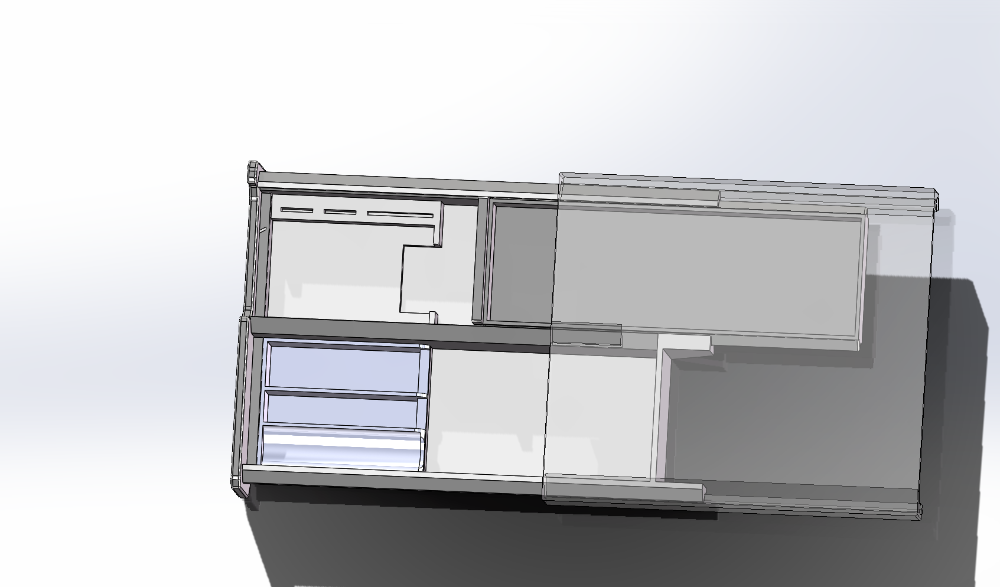
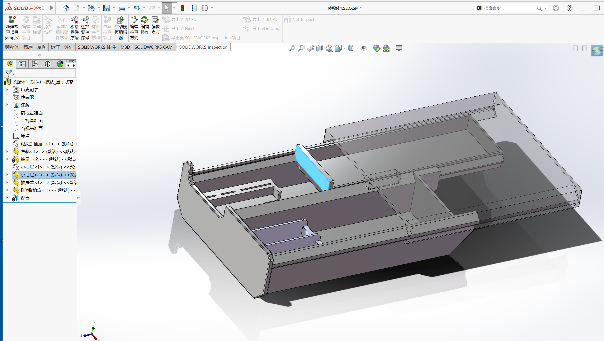

## 实战1：桌下抽屉设计

### 设计步骤

1. 分析需求：粘在桌面底下，收纳耳机盒，唇膏等，用3D打印制造
2. 滑动如何实现：联想生活，一种是抽屉导轨，但是太贵了，一种是滑动的那种木抽屉，但是因为是全包裹所以又太费材料了，所以最后选择了一种特殊的方式
3. 在设计的时候，思考怎么放物品，发现放笔这个，可以再设计一个小抽屉来专门放笔

### 选中

框选需要鼠标从右往左框选

### 编辑

编辑完零部件后可以去右上方点击提交按钮，设计树中蓝色文字变为黑色，说明成功提交

### 设计

设计零件时，很容易遇见零件需要修改的问题，我们在装配体中画零件是，在画时就要依据前一个的尺寸来画，这样修改的时候会自动修改

### 视图

零件上方的显示类型快捷键，点完会出现线架图，这个就能让图形只呈现线，看起来清晰

或者可以选额左边的剖视图 方法是点击后选中一个面 会有平行的切割

### 快捷的设置配合的方式

先点击一个面，然后转换视角到另一个面，然后摁住ctrl，选中另一个面再放开ctrl就会自动跳出配合关系

### 设置限位

只在sw上实现的功能要放到物理世界里也能实，抽屉实际上是可以无限往外拉的，要我们自己设置限位

### 报错

很多时候都是参考线条消失，看看自己是不是把原先用来配合的线给切了

### 绘图（这个重要）

在一个面上需要重复操作的时候，不要直接对着平面点击草图绘制，这样会和一开始的草图发生冲突然后打架，要先编辑零件，绘制草图再点击平面

### 合并

在设计时，两个零件能不能合成一个零件，这个要考虑零件的安装来决定，比如，对于这个抽屉能不能和盖板相粘连，它的所有的安装顺序应该是，先装导轨，再装大抽屉，因为有导轨的限位所以只能从后往前装，如果盖板和大抽屉粘连着就装不进去了，再装小抽屉，小抽屉从前往后插进去即可

### 安装

现在基本将抽屉的结构都搞完了，但是还要考虑安装的问题，sw里的安装不可能都和现实中一样。用胶水这种还是太逊了。这里考虑到抽屉的美观，用的是燕尾榫的方式，在设计燕尾榫的时候，又能发现抽屉的壁太薄了不够，所以要加厚，这里就开始修改模型

### 加厚

加厚面可以直接用移动面这一工具，可以在插入-面-移动-等距，这样可以很方便的增厚面

### 连接

先是设计了一个燕尾榫 将盖板和抽屉连接，再设计限位，有一种走一步看一步的感觉

### 修改

修改任何一个零部件的时候，都要注意与其相关的配合或者限位还能不能起作用，比如我们因为在上一步修改了导轨的长度，所以限位失效了，所以要重新进行限位块的设计

### 删除面

在设计完之后发现因为用了薄壁特征所以翘起来了一点，所以还是在插入-面-删除，可以快速将突起的面做到平行

### 圆角

在设计完之后对零件添加圆角和倒角，同时要注意，设置完圆角后可能会有连接上的问题，要记得进行进一步修改

### 3D打印

在不受力的地方可以增加一点材料的删减，比如导轨上方是可以切掉一块的，但是主播因为懒就没有做这一步（啊其实并不麻烦

### 成品展示

效果如图：

#### 一些设计

小抽屉可以用来放一些笔，抽屉盖让抽屉抽拉更方便，大抽屉内，右侧设计了DIY收纳盒，可以放一些唇膏大小的物件，里面可以放充电宝，左侧设计了可以放卡针和卡片的地方，并且设置了缺口让取用更方便

### 注

装配体的各个零件都被我提交到仓库同目录了，想要学习可以自取