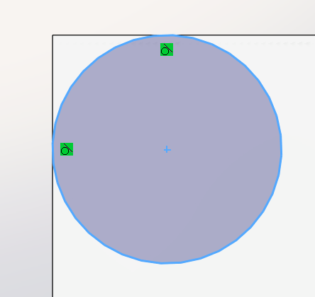
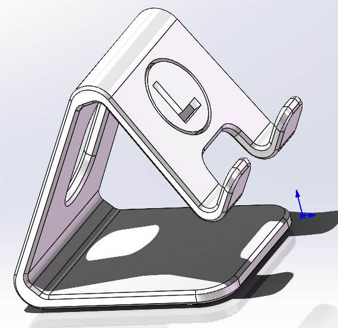

### 基准面

在菜单栏中点击参考几何体中的基准面，然后左上角点击零件特征，可以调节新建的基准面和基准面的基准之间的关系

关闭可以通过点击设计树中的基准面，然后在选项栏中点击眼睛，或者直接在零件上方点击眼睛，不过上方的这个眼睛是将所有基准面隐藏

基准面的选取可以是有点线面作为基准

而且可以通过三个点、两条线类似的方式来确定一些特殊的基准面

### 扫描

扫描就是将草图沿着零一草图为路径生成实体的办法

1. 草图轮廓生成：需要编辑两个草图，可以将一个延申的草图以另一个草图的形式生成实体，比如画出圆柱的中心的高和底面，sw就可以沿着高生成圆柱
2. 圆形轮廓生成：默认下面的东西是圆，可以结合特征中的曲线生成一个弹簧

### 螺丝

先画一个小截面，然后旋转凸台生成螺丝外形，螺纹的生成要去最上方的插入-注释-螺纹起始线，将鼠标放到圆柱面上就可以看到螺纹线了

### 如何在圆柱面上操作

比如说我想在圆柱上切出一个键槽

1. 可以直接在三大基准面上绘制，再在拉伸切除时对切除的起始进行重新定义
2. 可以添加基准面来进行绘制，最好是绘制一个和圆柱面相切的基准面

### 旋转切除

alt+c是构造线设置的快捷键

要记得设置构造线，其他图形保持封闭，在旋转切除时系统会自动补全这根线

### 剖视图

可以选择零件上方的对半切的图形来开启剖视图，主要是要在设计树中选择切面

### 视图工具

主要来自于上方的眼睛，可以取消几何关系显示和尺寸显示，在打开比较大的文件时可以用来减少卡顿

### 异形孔向导

就直接选好要打的孔的形状，然后再在需要打孔的平面上用鼠标定位即可

### 基准轴

在参考几何体中选择基准轴，只要点击一个点和一个面，过点垂直于该平面的线会自动成为基准轴，看不到要去视图工具（眼睛）中是不是被隐藏了

### 圆周阵列

和线性阵列类似，找到基准轴后可以将一个圆绕基准轴旋转后均匀分布，设置数量有3456，分别对应120°，90°，72°，60°

### 镜像

类似于草图中的镜像，但是在sw中不连续的实体是两个实体，所以在镜像时**要选择**“要镜像的实体”，**而不是**“要镜像的特征”

### 快捷键

ctrl+8正视草图

alt+c设置构造线

ctrl+b可以重建模型（让消失的实体显示）

### 不能生成厚度为0的几何体

比如在一个长方体中切一个圆柱，若圆只与一边相切，则会报错，若与两边都相切，则又可以了，是因为两边都厚度为0将原来的长方体切成了两个实体。

这样就可以解决报错问题

### 练习

绘制一个手机支架，做出的效果大致如图

同样把做好的内容提交到仓库了

### 后续改模型

可以直接在左侧的设计树中找到当时操作时的草图，直接修改尺寸就行

### 解决报错

哪里错了就到哪里去找，看看遗失的线原本是怎么产生的

### 父子关系

父特征会影响到子特征

编辑草图平面就是在设计树中，点开要编辑的对象中的第二个，会跳出编辑基准面的

### 文件保存格式

stp是最常用的中性文件格式，放到其他三维建模软件中也能打开