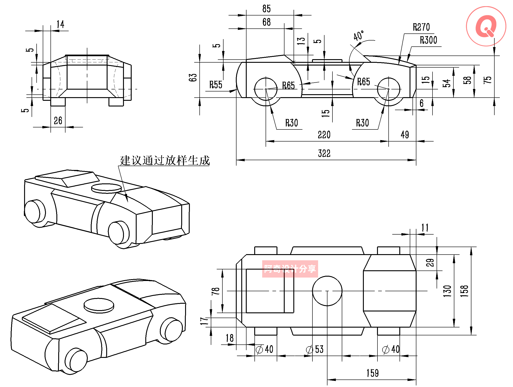
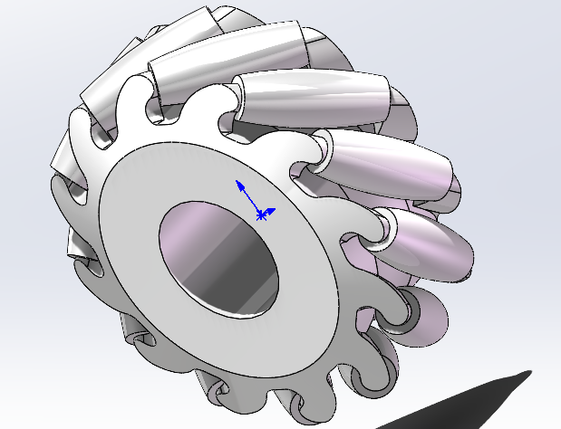
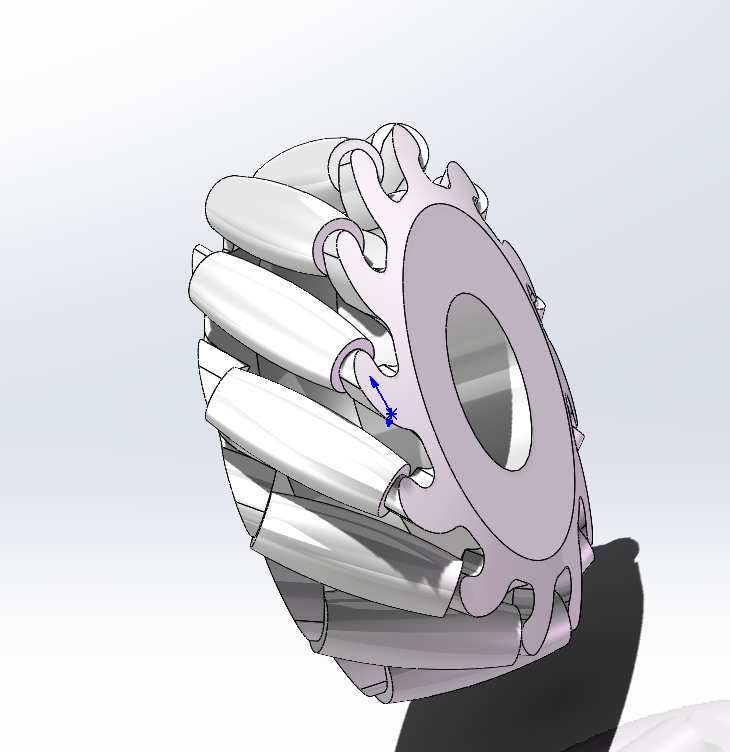
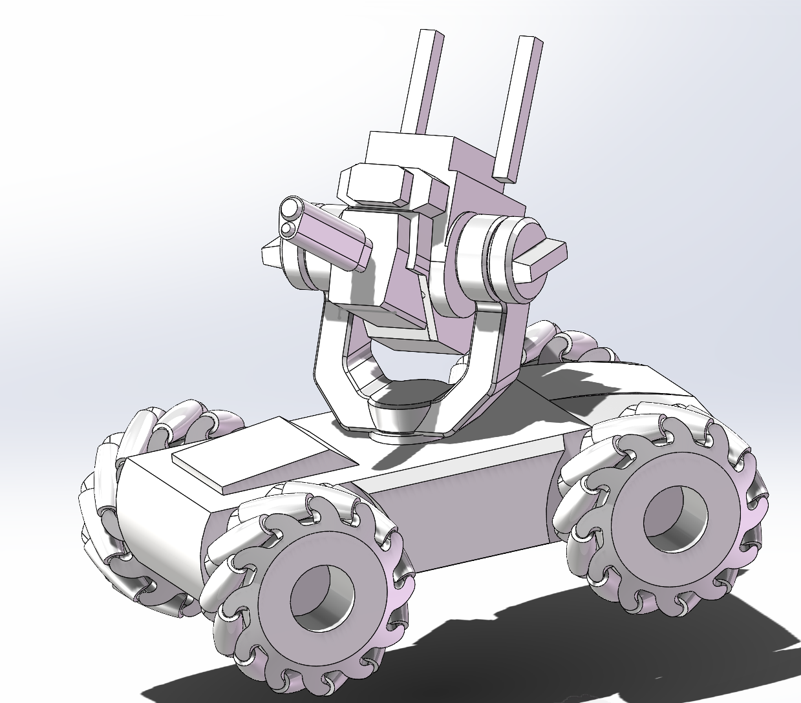

适当的做一些练习：[SOLIDWORKS 40道练习题 草图零件装配体工程图 全涵盖 - 飞书云文档](https://ifcski218x.feishu.cn/docx/ZITWdjgx8oMQUpxbmn9cIsDyn6d)

## 1.4：指尖陀螺

其实只要用圆周阵列来做就可以，这个太简单了就没保存

## 2.5手柄

最后的手持部分其实有点表述不清，我觉得应该还是应该有一些条件我没看明白，但是感觉总体上问题不大

## 1.5脚轮

感觉这个未来可能比较常用

但是这个只是一个侧面的图，如果真的要做东西出来的话就得把每个实体都设计出来，不过轮子怎么画啊，还真没想出来，回头找个教程学学吧

## 机甲大师小车

### 2.3炮台支架

#### 发现自己无法拉伸凸台

图形没闭合，可以试着用很薄的薄壁特征观察缺口在哪，或者一根线一根线慢慢找过去

#### 圆角

其实很多地方不用自己去画圆和设置切线，只需要用圆角选中边线即可

### 2.14车身

#### 绘图顺序

核心应该是从已知的尺寸出发，这里应该是先画出322×63的长方体，然后一个个切，然后再把边上，上方的几块内容都加上去

#### 特征中的镜像

可以通过增加基准面的方式来镜像特征，比如轮子就可以直接这样复制，另一个镜像实体，只能镜像草图

#### 倒角

选择倒角，点击第二个图标，并且直接设置参数，这样就不用自己再去画平面去切

#### 放样凸台

插入-凸台/基体-放样

可以用来生成凸台，只要画好上下两个面，再选中一下引导线，就可以生成一个凸台了

两个顶面可以都单独为其生成一个基准面，基准面的选择可以直接选中其他部分，不一定要平移

### 2.21 左轮

#### 圆周阵列

分清楚选中实体、选中面和特征，这两个的区别，比如这里就得用选中实体来进行阵列

#### 画法

这个轮的画法也很阴间，就是先建立个新的基准面，然后把那个柱体一样的东西画出来，然后用**旋转**把中间的结构画出来，然后再连接

好了终于画完了，最后的效果大概是

### 2.22麦轮右轮

#### 画法

直接在中心面上镜像，然后在上方菜单栏里找到插入-特征-删除/保留实体，然后把原来的东西都删掉，只留下镜像后的实体即可

#### 小车装配

直接把几个恶心的结构一起放起来，然后就可以得到这样一个东西

爽了，决定放下solidworks一段时间

在打下这段文字的时候正好在朋友家里打麻将，好了不说了我要赶紧提交了上桌了
### 注

做完的东西都会放在同目录下面，想要的话可以自己去仓库里看看