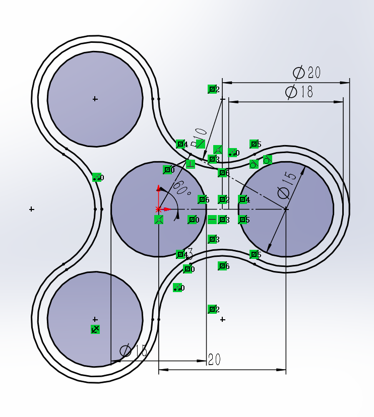
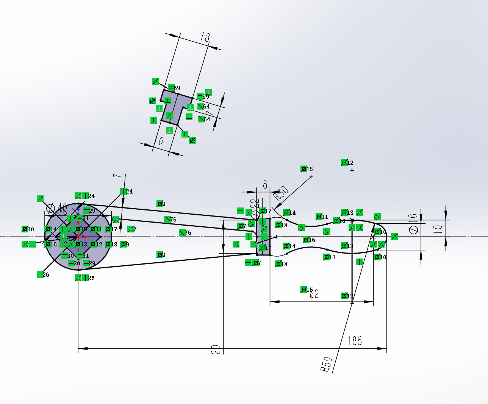
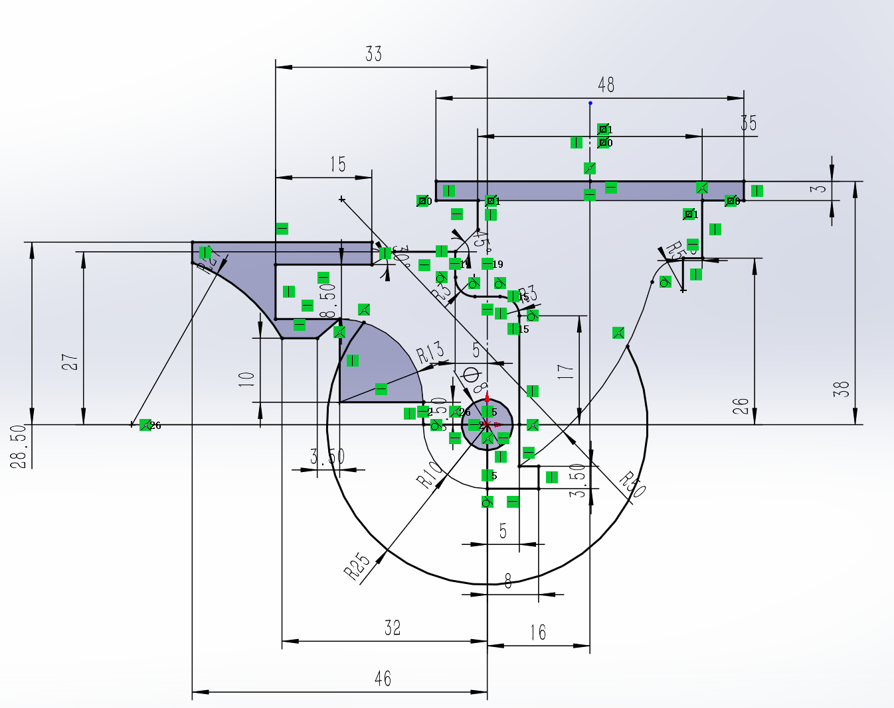

适当的做一些练习：[SOLIDWORKS 40道练习题 草图零件装配体工程图 全涵盖 - 飞书云文档](https://ifcski218x.feishu.cn/docx/ZITWdjgx8oMQUpxbmn9cIsDyn6d)

## 1.4：指尖陀螺

其实只要用圆周阵列来做就可以，这个太简单了就没保存

## 2.5手柄

最后的手持部分其实有点表述不清，我觉得应该还是应该有一些条件我没看明白，但是感觉总体上问题不大

## 1.5脚轮

感觉这个未来可能比较常用

但是这个只是一个侧面的图，如果真的要做东西出来的话就得把每个实体都设计出来，不过轮子怎么画啊，还真没想出来，回头找个教程学学吧

### 注

做完的东西都会放在同目录下面，想要的话可以自己去仓库里看看