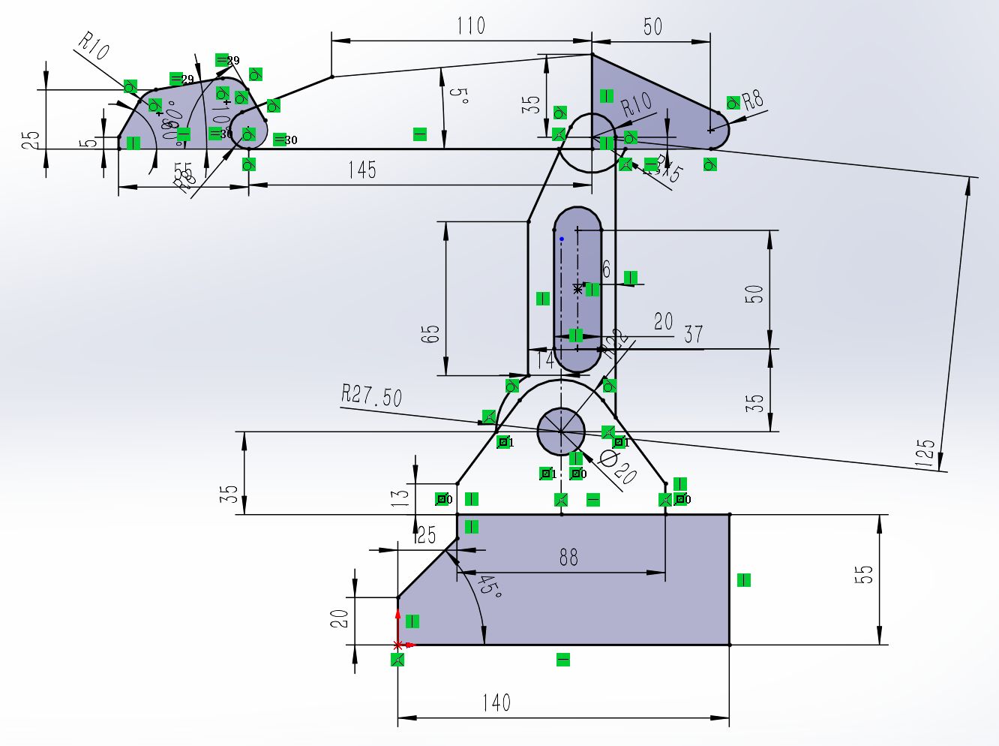

## 草图绘制

黑色的线是已经完全确定的线

可以用ctrl选中线段，或者直接点击线段中间绿色图标可以看到几何关系，可以在左侧设计树内进行修改		

### 裁剪

#### 强劲裁剪

切过的线段会自动缩至最近的端点，按住shift可以反向伸长线段

#### 裁剪到最近段

和上面差不多，少一个shift的额外功能

### 转换实体引用

用法有二：

- 用一个按钮画出这一个平面的所有边界线

- 可以选择其他平面上的草图投影到当前草绘平面上，比如先进入草图绘制，然后直接点转换实体引用，再点击要转换的面，于是就会直接投影到当前想要的面

### 等距实体

例子是可以在圆面上作另一个圆，看起来挺方便的

### 绘制草图的思路

就是先将线段全部画出来，再通过只能尺寸将所有线段都定义完整

要养成和原点建立联系的习惯

要看哪里没有定义上，就挪动蓝色的线或者点，多思考

### 线性草图阵列

例子给的是可以将一个圆像阵列一样推出去，形如3×3的圆方阵

### 常见的技巧和注意

1. 在线段和点多起来的时候，要注意自己预先随便画的线是不是附带了奇怪的几何属性，会在之后的标注中出现过定义
2. 依旧是先把所有的线都画完，再去标注尺寸，图像自动会变化成确定的形式的，画圆弧的切线最常见的方法是先随便搞条线然后画个三点弧，然后再用ctrl选中添加相切的几何关系
3. 可以多注意几何关系，比如练习题左上角的图形，有两队圆弧有相等的几何关系，这样才能让图像都能固定下来

### 练习

是一张有一点点复杂的图，难是不难，主要是熟悉各种操作

文件我也提交到仓库里了，就在我的sw文件夹内，有需要可以去下载看看设计树