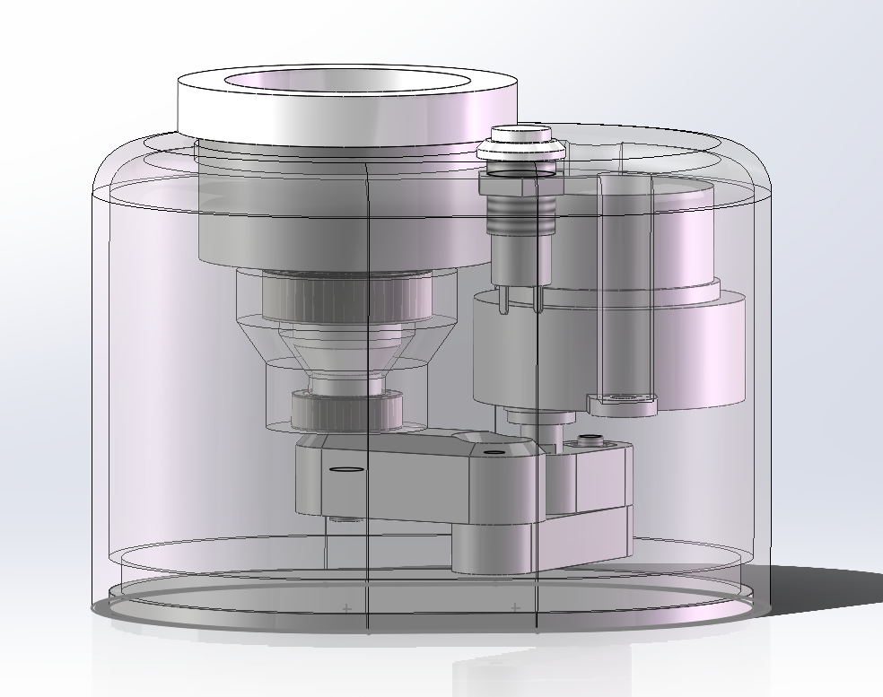
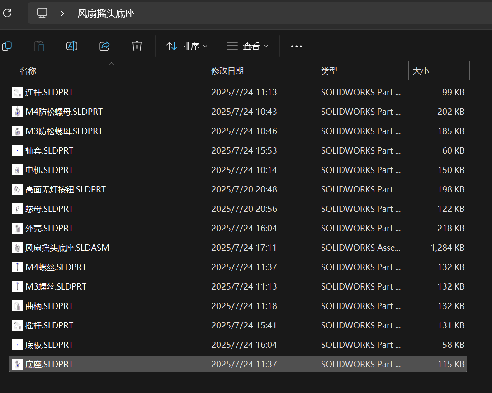

## 抽壳

可以选定底面，将实心体变为厚度自定义的壳体

## 添加标准件

右侧第三个点进去，再点击GB，再点击就可以找到对应的零件

## 副本

在螺丝的绘制中，我们发现M3，M4的螺丝有类似的形体，只是需要修改一点点的尺寸，所以可以通过保存副本的方式来快捷的操作

在另存为里找到<另存为副本并打开>，然后修改名字为新零件名称，点击保持原始文档打开，然后点击零件后编辑草图，就可以在原来的图上修改尺寸了

## 版本

### 大版本

大版本指2021、2022这些以年份命名的版本

低版本的sw无法打开在高版本中保存的图纸

如果一定要打开的话，那就只能将起保存为X_T格式或者step格式，但是会带来看不到设计树的结果，

### 小版本

小版本是指大版本后的spxx

比如2021刚发行是sp0，之后慢慢打补丁就慢慢变到了sp5，一般sp5是最稳定的小版本

所以一定要把自己的软件更新到最新的小版本

## 打包

打开装配体其实是同时打开了所有装配体中的零件，单单把装配体发送给别人是没法打开的，所以需要打包来将对应的所有零件同时保存

从文件中找到pack and go，然后就可以顺利打包所有东西进一个文件夹里

### 前后缀

就是直接在方框里输入想添加的前后缀，这样零件和装配体的文件都会统一的加上一个前后缀

通常都推荐将零件添加一个后缀，我们要极力避免重名的零件出现

## 旋转

用右键选中零件其实可以直接旋转零件

在特征栏中找到平移零件的下拉菜单里找到旋转零件，这样就可以绕轴旋转零件

## 孤立

在看一些细节的结构时，可以在设计树中通过ctrl选择两个零部件，然后右键使他们孤立，这样就可以单独检查其配合情况

## 快速查看

用ctrl键可以在左下角快速查看其关系

比如选中两个面就能看到其垂直距离

## 步骤

在基本零件都做完之后，需要检查连接和安装的问题，每一个零件都需要对应的思考

## 结课感想

问题还是很明显的，听阿奇设计内部结构的时候听不懂，机械设计这一块的知识啥都不会，所以只是简单听了一下了解了大概，机械设计这一块的知识还需要补啊...

然后其中的安装，固定等等内容，都需要多方面的去考虑，而且有很多“意想不到的细节问题”，这个感觉大部分都是经验来解决的

后面对零部件进行的细节优化我也没有跟着一步步去做了，等我学了一些设计的知识之后再来吧这个内容补上吧

## 成果

