因为今天在调试的时候发现自己页面上的图片死活显示不出来，还找不出来错误，于是在调试的时候偶然发现了开发者模式这个工具，简单使用后发现有点意思，于是找了些文章来学习一下

## 一、如何调出开发者工具

在浏览器页面上：

- F12 键 (笔记本电脑 Fn + F12)
- 右键选择 检查(N)
- 快捷键 Ctrl + Shift + i

## **二、开发者工具初步介绍**

开发者工具最常用的四个功能模块：

[元素](https://zhida.zhihu.com/search?content_id=139659935&content_type=Article&match_order=1&q=%E5%85%83%E7%B4%A0&zhida_source=entity)（ELements）、[控制台](https://zhida.zhihu.com/search?content_id=139659935&content_type=Article&match_order=1&q=%E6%8E%A7%E5%88%B6%E5%8F%B0&zhida_source=entity)（Console）、[源代码](https://zhida.zhihu.com/search?content_id=139659935&content_type=Article&match_order=1&q=%E6%BA%90%E4%BB%A3%E7%A0%81&zhida_source=entity)（Sources），[网络](https://zhida.zhihu.com/search?content_id=139659935&content_type=Article&match_order=1&q=%E7%BD%91%E7%BB%9C&zhida_source=entity)（Network）。

### **1、元素（Elements）**

> ❝ 查看网页页面的所有元素，修改元素的代码与属性。用于查看修改元素的属性、CSS 属性、监听事件以及断点等等。
>
> ❞

#### **查看元素的代码**

点击左上角的箭头图标（或按快捷键 Ctrl+Shift+C）进入选择元素模式，从页面中选择需要查看的元素，可以在开发者工具元素（Elements）一栏中定位到该元素源代码的具体位置。

查看元素的属性：定位到元素的源代码之后，可以从源代码中读出改元素的属性。

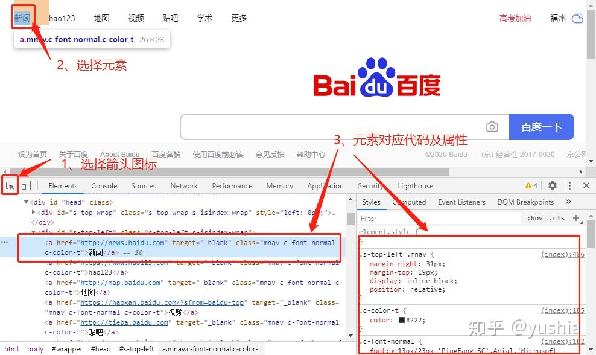

#### **修改元素的代码与属性**

点击元素，然查看右键菜单，可以看到 chrome 提供的可对元素进行的操作：包括编辑元素代码（Edit as HTML）、修改属性（Add attribute、Edit attribute）等。双击就可以对元素进行更改了，或者选择Edit as HTML，也是可以的

 **「注意」：**

这个修改也仅对当前的页面渲染生效，不会修改服务器的源代码，故而这个功能也是作为调试页面效果而使用。

#### **给元素添加断点**

在元素的右键菜单中选择断点选项（Break on…），选中之后，当元素被修改（通常是被 JS 代码修改）时，页面加载会暂停，然后可以查看该元素的属性。元素断点添加之后，可以在右侧栏的 DOM Breakpoints 页面中看到，这个页面可以看到当前网页的所有元素断点。

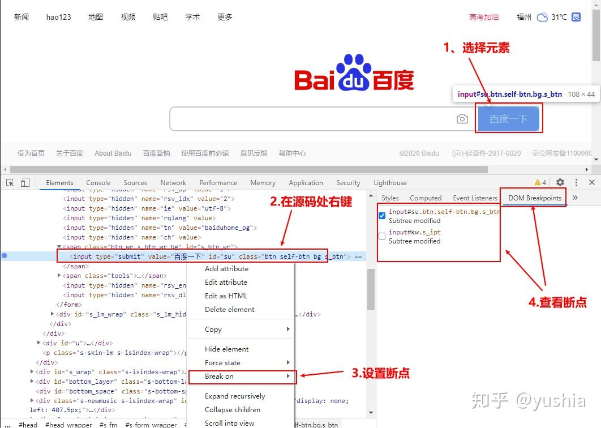

#### **查看元素的监听事件**

元素的右边栏的 Event Listener 页面，可以查看到该元素的所有监听事件。在开发中，尤其是维护其他人的代码时，会出现不了解元素对应的监听事件，这个时候，可以在这个页面中找到。这个页面不仅能看到对应的事件函数，还可以定位该函数所在的 JS 文件以及在该文件中的具体位置（行数）。

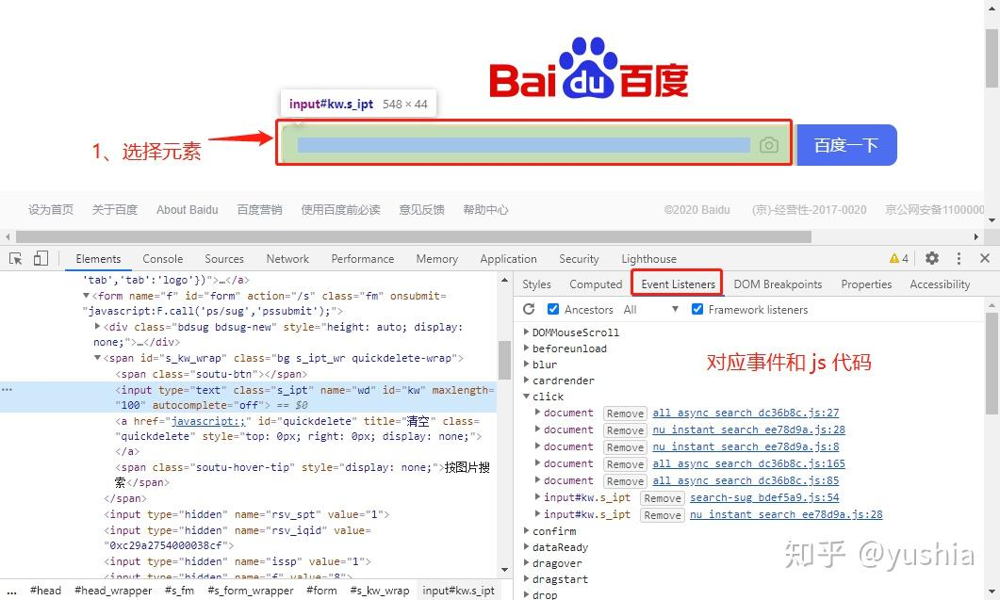

### **2、Console（控制台）**

#### **查看 JS 对象的及其属性**

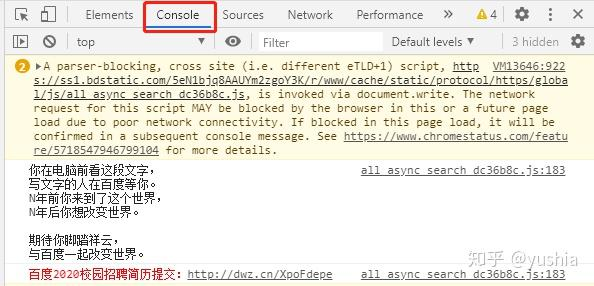

#### **执行 JS 语句**

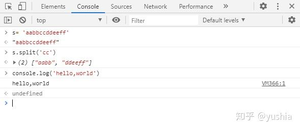

#### **查看控制台日志**

当网页的 JS 代码中使用了 console.log()函数时，该函数输出的日志信息会在控制台中显示。日志信息一般在开发调试时启用，而当正式上线后，一般会将该函数去掉

在测试界面时，如果出现 Bug 问题，一般情况下会在这栏展示，查看调试日志信息或者异常错误信息，然后前端开发工程师根据具体问题来调试，进行解决问题。

### **3、Sources（源代码）**

#### **查看源文件**

在源代码（Source）页面可以查看到当前网页的所有源文件 包括：样式、css、图片、js 文件等。在左侧栏中可以看到源文件以树结构进行展示。

#### **添加断点**

在源代码左边有行号，点击对应行的行号，就好给改行添加上一个断点（再次点击可删除断点）。右键点击断点，在弹出的菜单中选择 Edit breakpoint 可以给该断的添加中断条件。

#### **中断调试**

添加断点后，当 JS 代码运行到断点时会中断（对于添加了中断条件的断点在符合条件时中断），此时可以将光标放在变量上查看变量的属性

也可以在右边的侧栏上查看：

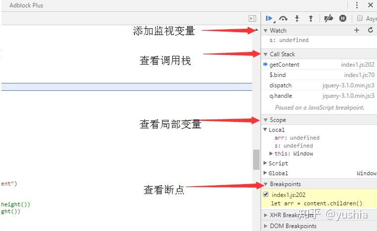

在右侧变量上方，有继续运行、单步跳过等按钮，可以在当前断点后，逐行运行代码，或者直接让其继续运行。

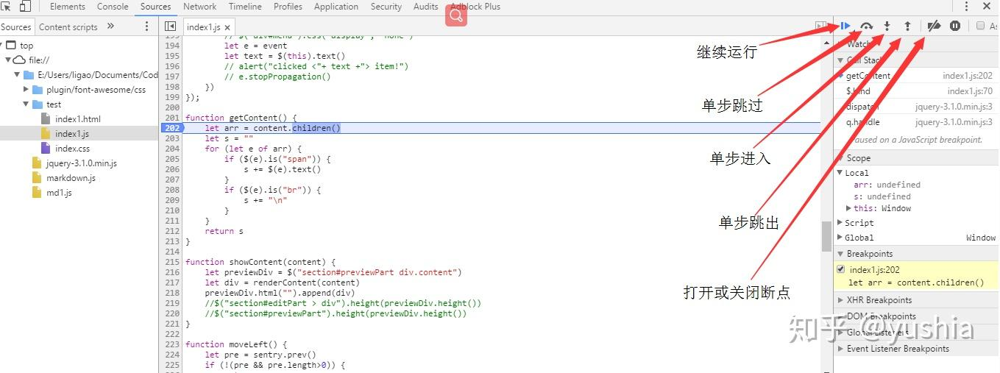

### **4、Network（网络）**

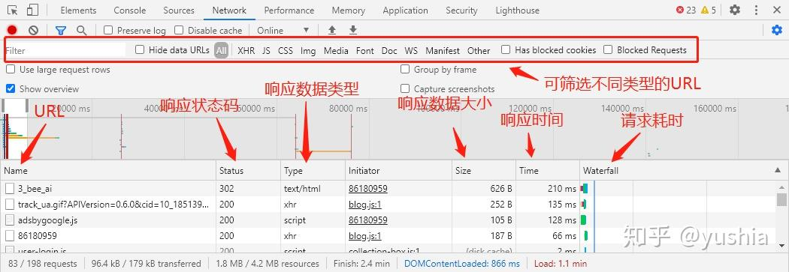

## **三、F12 的妙用**

### **1、复制不可复制的文字**

有些文章设置了不可复制，那么如果想复制文字时，

按下 F12，或者右击鼠标选择【审查元素】，点一下下边弹出框左上角鼠标，然后去点击页面你想要的文字，下面框代码中亮的部分，看不到文字就点击箭头展开，看到文字，双击或者右键 copy

### **2、下载不能保存的图片**

例子（比如说某库网需要 vip 才能下载的图片）

首先我们打开不能直接下载图片的网站，然后使用快捷键 F12，或者右击鼠标选择【审查元素】-\> 看到对应的 img 选择 src 右键点击 open in new web

或者选择【 network】，再选择【 Img】,刷新页面就看得到下面有图片资源了，大部分网页是这样结构，有些图片会在【 sources】那里打开左侧栏（请求回来的图片资源），总之能找到图片的资源所在位置就可以了。

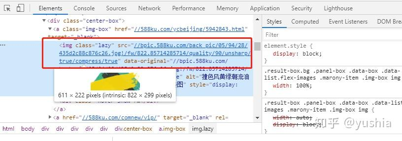

### **3、截取整个网页**

使用浏览器自带的截屏功能截取超过一个屏幕的网页

F12 或 Ctrl+ Shift+ I 打开开发者工具，在任意 tab 上按 Ctrl+ Shift+ P，在弹出的输入框里输入 Capture full size screenshot（其实不需要输入完整，可以自动补全），然后按回车即可

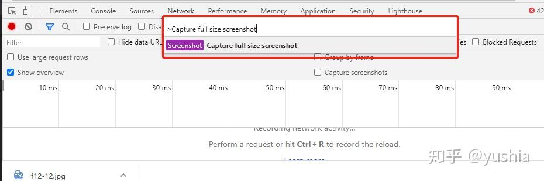

### **4、编辑页面上的任何文本**

在控制台输入`document.body.contentEditable="true"`或者`document.designMode = 'on'`就可以实现对网页的编辑了

### 5丶查看网页登陆的隐藏的密码

我现在使用F12打开开发者工具，点一下下边弹出框左上角鼠标，然后去点击页面你想要看到的密码，或者鼠标放到密码上右键审查元素/检查也可以，找到行内的文本框类型：type\=“password”,改为type\="text"回车，就可以了

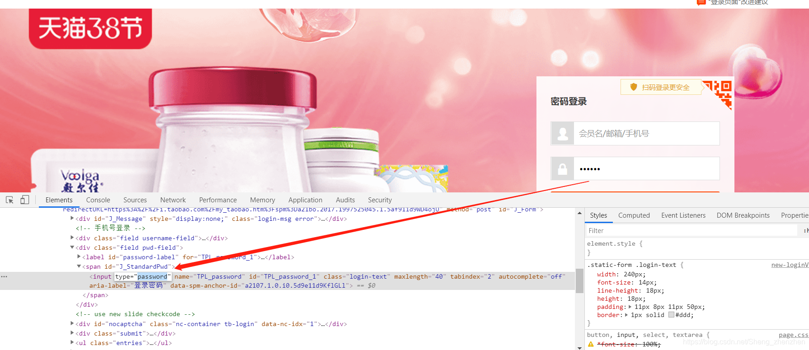

## **四、参考资料**

[https://blog.csdn.net/Sheng_zhe](https://link.zhihu.com/?target=https%3A//blog.csdn.net/Sheng_zhenzhen/article/details/104674523)

https://zhuanlan.zhihu.com/p/231865779