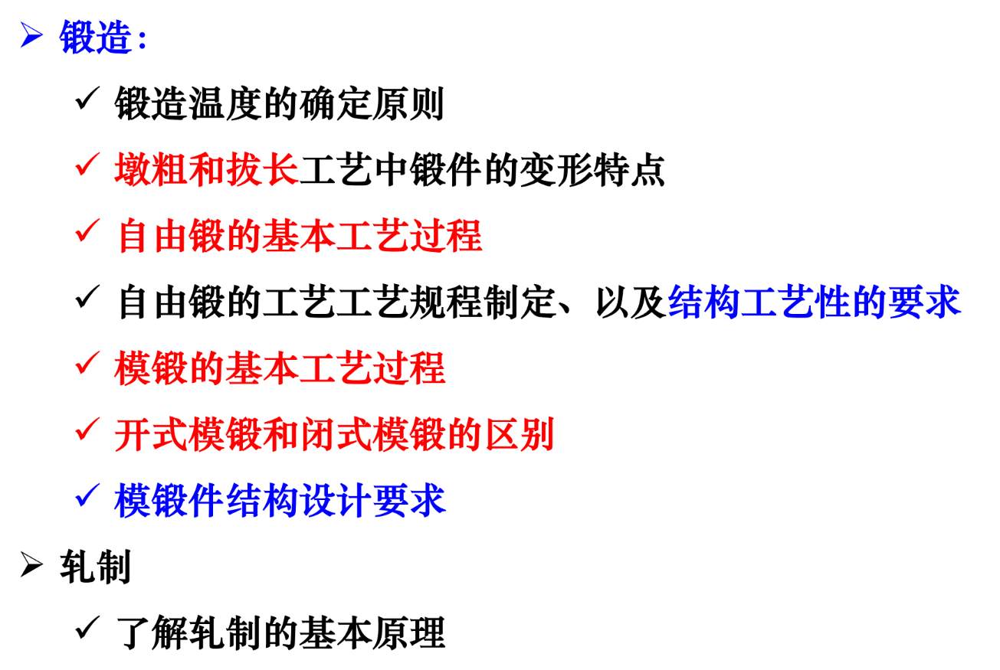
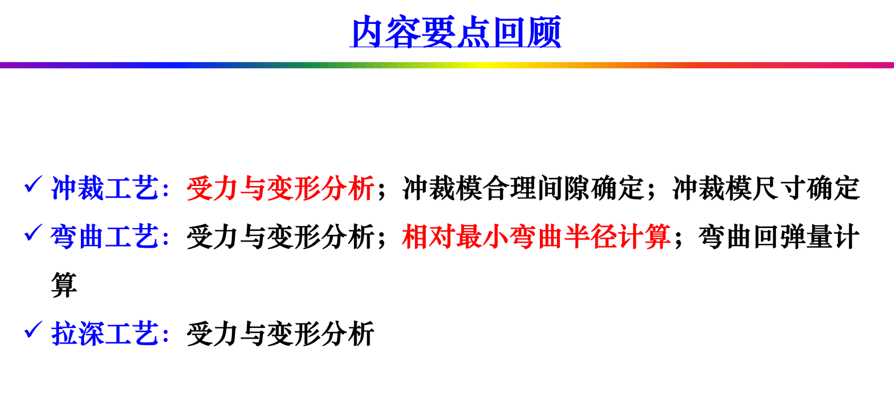
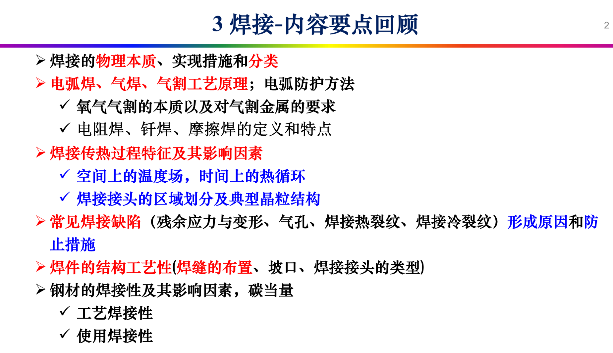
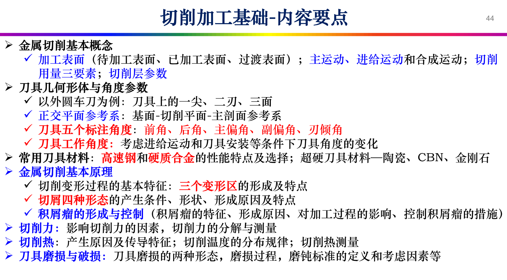
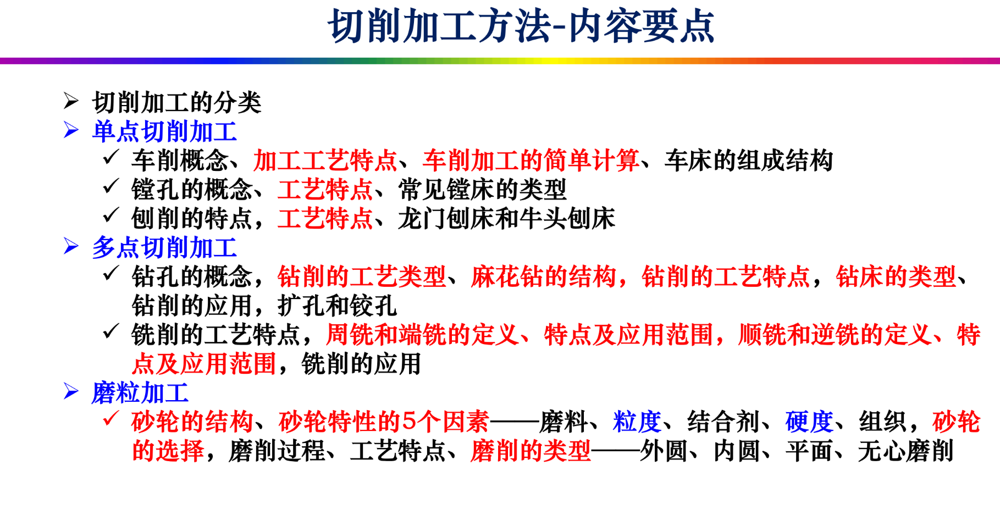
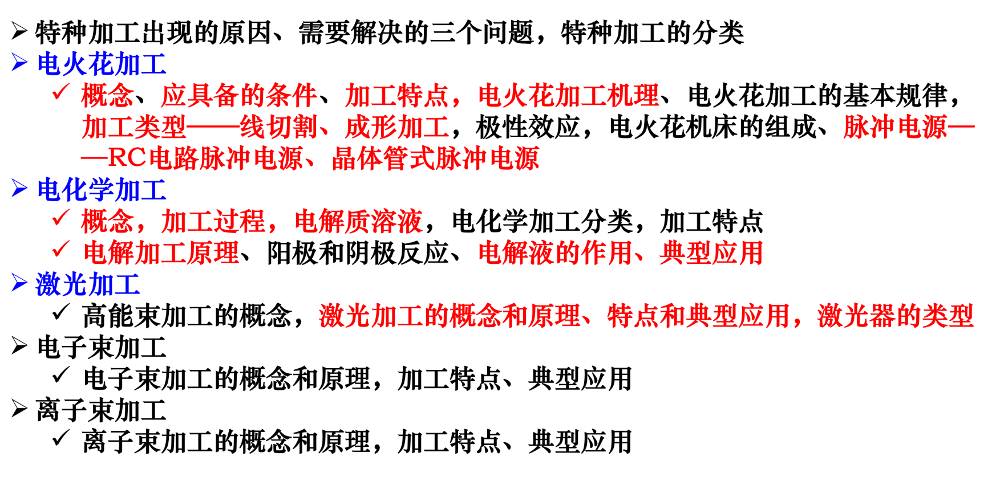

到我们这一年变成了半开卷，可以带一张手写A4纸进考场，还是很好的，相对上压力小了很多，主要是理解上需要花时间吧，平时作业其实有点小多，因为知识点确实多，而且字数多写起来比较慢。选择上可以补天但是要做好耗大把时间进去的准备、、、

大作业是从老师给的十个选题里选择一个，然后找两篇相关的英文文献，阅读后思考如果自己上手这个课题会怎么做，将自己的思考做成一张A4大小的海报当中，我是在overleaf的在线编辑平台上找了一个模板然后做的，后来班级展示的时候发现其实浙大的海报是有一个固定的模板的，后来我找了一下发现没找到（悲），如果大家谁有可以发我一份嘛（戳手）

需要注意的一点是，大家不要因为制作半开卷浪费了过量的时间，我就是把A4纸正反面都抄的贼满，但是其他课程复习的时间就很少了。我就是因为这门复习的太多了所以马原就只背了一个超级精简版的讲义，最后考的不好。而且设计与制造也没考好。哈哈。抄的时候多看看老师的课件上的重点吧。我在这里扔一下汪sir课件上的重点：

汪sir布置的作业题我也都保存下来了，放在我的仓库里，还是蛮建议自己想一遍的，有不小的概率会出现原题。