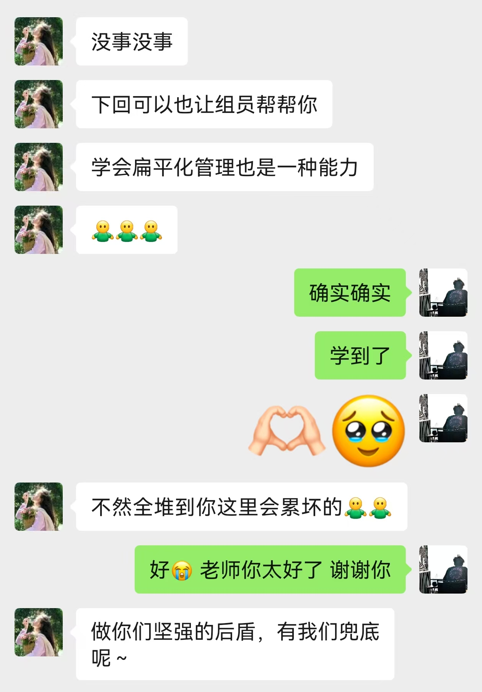

这次新生破冰也学到挺多的，主要是23号那天最忙，其他时间其实都还好，一想到手下其实有好多人可以吩咐着去做事，就感觉非常安心。

但其实把活分下去也是后来才明白的，拥有了睡个午觉直接昏死过ddl的经历，就是起来看到微信和钉钉的同时的@就知道肯定出事了。果然如此，于是就有了，如下的对话

害害还是辅导员太好了。我确实不适合组织这些的，要不就让我一个人把工作全部干掉，要不就把分工讲的非常清楚，最好互不干涉的那种

我不适合组织也能从自身的性格上面找原因的，之前在信运的面试其实就能说明的，我不喜欢严肃，不喜欢压力，不喜欢紧张。我还是适合活在欢乐和轻松中。

我其实并不像网上所展现的那么热情，我一直强调，自己只有心力爱小部分人，实际上也是这样，当回完很多xpy的消息我真的巴不得给微信删掉。或许我只是享受成为前辈，被人发自心底的尊重的感觉。嗯这也是我一直都很向往的。阿谀奉承这种，我非常的厌恶，我其实根本懒得装。

不知道，这次确实也成长挺多的，这次他们的自我介绍环节我还想了好久，要怎么设计才比较有意思，于是就是让他们抽奖，回答我准备的问题，问题如下：

1. 高考前一天在做什么

2. 如果能瞬间移动，最想去的地方是什么

3. 最喜欢的一部电影，简单介绍一下这部电影

4. 如果从此衣食无忧（比如彩票中巨奖），你会选择做什么

5. 进浙大有没有什么特别的理想，或者对自己的新的要求（不要太宽泛）

6. 浙大有没有和你想象中不一样的地方 或者有没有对浙大有一些期待 学长们可以帮你打破

7. 高中最讨厌的学科，为什么

8. 最崇拜的一个人，为什么

9. 最想有的超能力，为什么

10. 最喜欢的消遣时间的活动

11. 你觉得在一年之后 你会报名当学长组吗 为什么

12. 对自己的高中说一些话

13. 对自己高中的同学们说一些话

14. 昨天晚上寝室里聊天的最印象深刻的话题

后来因为问题基本都问过了，所以我干脆就让他们介绍一下自己的家乡，反正原则就是让他们多开口说话，于是这一趴气氛真的弄得很好。

而且当时想出问题11的时候，还真的觉得自己想了一个很好的问题，不过xpy的回答确实和我想的答案不一样，大概是刚进大学的缘故吧，还对这些没什么具体的感知，倒也不怪他们。

好了就说这些吧，这次不仅认识了一些xpy哇，其实还有很多同级的朋友，加上微信发现和尹老师一见如故，这种事情真的存在吗，我其实一直很向往那种友谊，我和对方都能直接断定，对方肯定是很好的人，从而跳过繁琐的自我介绍，直接交出最底层的坦诚和信任。不知道，反正我一直都觉得自己有不输任何人的底气。我人就是很好。

ppt在同级的仓库下，有需要的可以自取